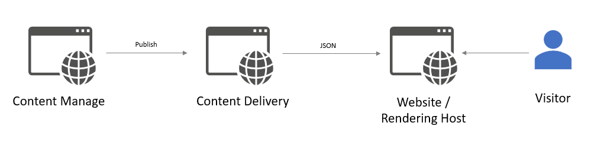

# Architecture Overview

## Traditional Sitecore Architecture
In a traditional Sitecore Architecture, we have two main server roles:

1. Content Management (CM) - this is where content editors log onto to manage the content of the site. This server is typically behind a firewall.
1. Content Delivery (CD) - this environment is public facing and is where visitors view the website. In a Traditional Sitecore Architecture, the integration logic, business logic, and rendering logic
uses ASP.NET, MVC as the technology to serve and render the website.

## Headless Sitecore Architecture
Sitecore with Next.js uses a Headless Architecture approach. In a headless architecture, the front-end layer is decoupled from the back-end, meaning that the website's content is served via APIs or web services,
rather than being directly rendered on the server. 
  

The key components of a Sitecore Headless Architecture include:

1. CM - remains the same as in a traditional architecture.
1. CD - this role switches to solely serve content in a JSON format.
1. Rendering Host - The public facing server is now moved to what is called the rendering host. You are free to use any number of frameworks and technologies, such as React.js, Vue.js, or .NET Core (in our case, Next.js) to render the website.  
  Integration and business logic also moves here, meaning that the rendering host also communicates directly to any external APIs that are not related to content. Content from the CD is just one integration point.