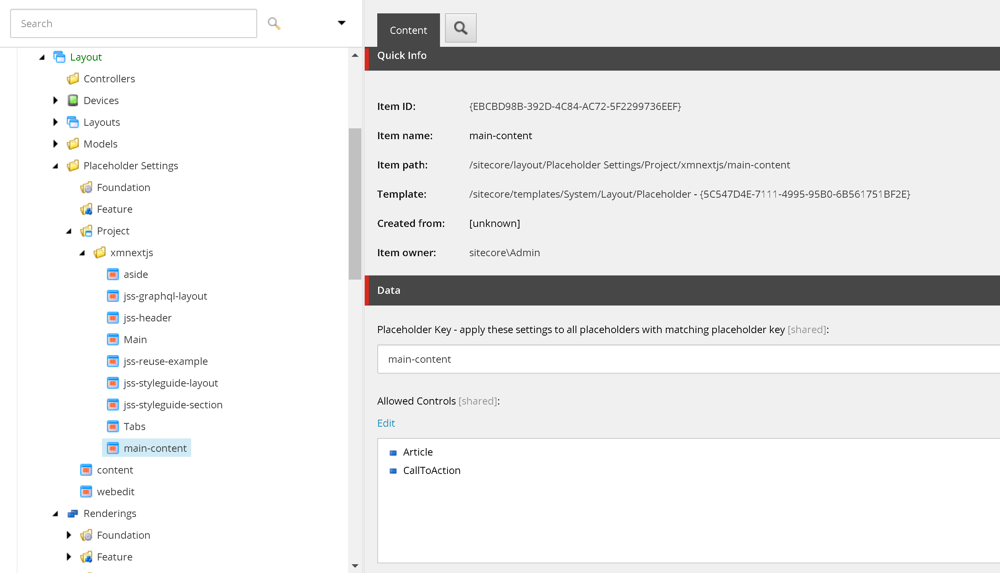
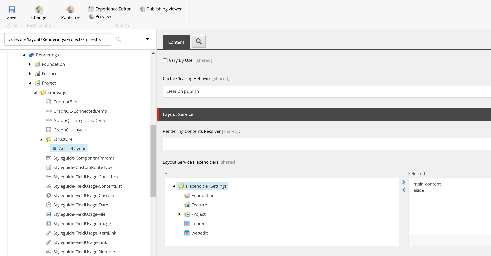
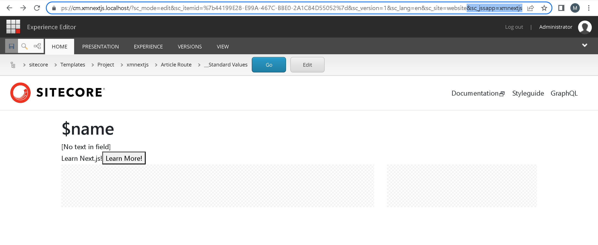
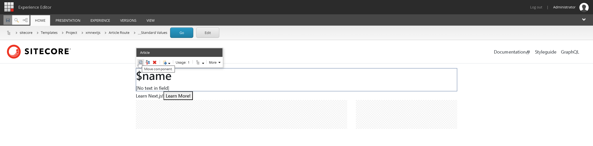

import { Callout } from 'nextra-theme-docs'

# Sitecore Next.js Placeholder
A placeholder in Sitecore is a section of the page where we wish to allow content editors to add components to.

So far we've only been able to add components to the `jss-main` placeholder. In a typical article page, you would have a 2 column layout with
main content in the middle and some additional content on the side. 

For this lesson, we will create two placeholders: `main-content` and `aside`.
## Create placeholder settings
1. Navigate to `/sitecore/layout/Placeholder Settings/Project/xmnextjs`
1. Insert a placeholder `aside`
    1. Add `CallToAction` to Allowed Controls
1. Insert a placeholder `main-content`
    1. Add `Article` to Allowed Controls
    1. Add `CallToAction` to Allowed Controls


## Create rendering to hold the layout  
1. Navigate to `/sitecore/layout/Renderings/Project/xmnextjs`
1. Create a rendering folder `Structure`
1. Insert rendering `ArticleLayout`
    1. Scroll to the bottom to `Layout Service Placeholders`
    1. Add `main-content` and `aside`

1. Once we've created this rendering, we'll need to allow this to be added to the `jss-main` placeholder
    1. Navigate to `/sitecore/layout/Placeholder Settings/Project/xmnextjs/jss-main`
        1. Remember the display name is `Main`
    1. Add `ArticleLayout` which you just created to the Allowed Controls

## Create the component
To create placeholders in our component, import the `Placeholder` component from `@sitecore-jss/sitecore-jss-nextjs`.
Make sure when specifying where the placeholder goes to match the name prop with the placeholder key specified under the [placeholder settings](#create-placeholder-settings).
```tsx filename="src\rendering\src\components\Project\Structure\ArticleLayout.tsx" {1, 8, 11}
import { Placeholder } from '@sitecore-jss/sitecore-jss-nextjs';
import { ComponentProps } from 'lib/component-props';

const ArticleLayout = ({ rendering }: ComponentProps): JSX.Element => {
  return (
    <div className="row">
      <section className="col-8">
        <Placeholder name="main-content" rendering={rendering} />
      </section>
      <aside className="col-4">
        <Placeholder name="aside" rendering={rendering} />
      </aside>
    </div>
  );
};

export default ArticleLayout;
```

## Update page rendering
At this point, we can start rearranging the components to our article pages. We will update the Standard Values item so that all of our article pages are updated.
1. Navigate to `/sitecore/templates/Project/xmnextjs/Article Route/__Standard Values`
1. Edit this item in Experience Editor
    1. Publish > Experience Editor
    1. **Note**: To get Experience Editor to work with Standard Values, add `&sc_jssapp=xmnextjs` to the URL
1. You should see our previous components (from previous lessons) `Article`, `CallToAction`, and checkered areas on the page. The checkered areas are
our new placeholders.

1. Click somewhere on a blank spot to the right of the Article component.  
Some options should show up. Click on the `Move component`.

    1. Notice there is only one placeholder where you can move this component to. Move it to the `main-content` placeholder.
1. Select the `CallToAction` component and click on the `Move component`
    1. Notice there are multiple places where you can move this component to. *Why is this?*
    1. Move it to the `aside` placeholder
1. Save the page and publish
1. Visit any of your article pages and notice that your components are now side by side.

<Callout>
    Knowledge check:  
    1. What is a placeholder?  
    1. How do we restrict what renderings are allowed in a placeholder?  
    1. What is a placeholder key?  
</Callout>