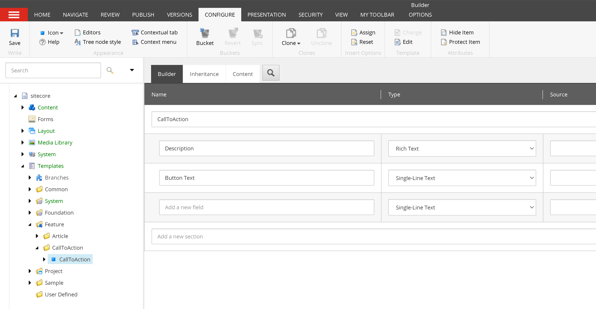
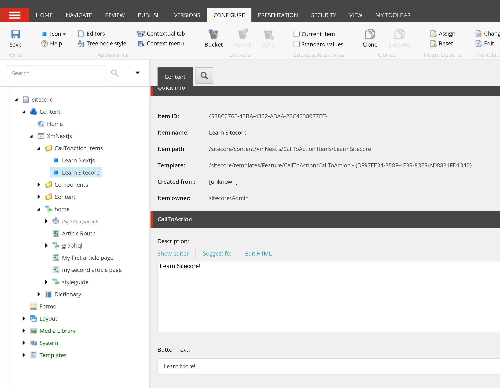
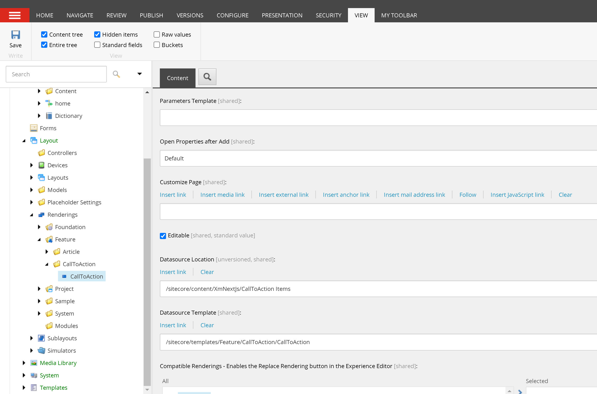
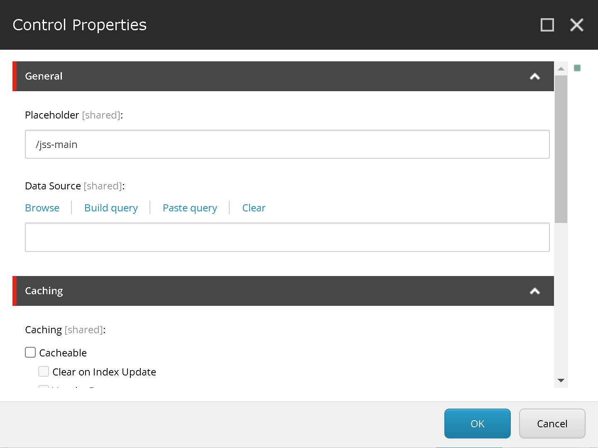
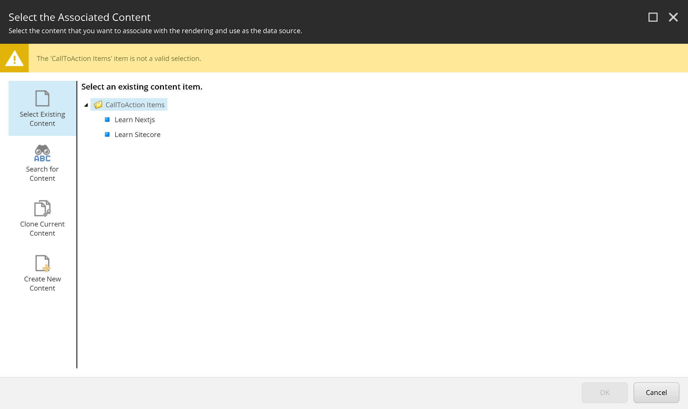

import { Callout } from 'nextra-theme-docs'

# Create a Sitecore Next.js component with reuseable data
We previously created a [content editable Sitecore Next.js component](/build/sitecore-nextjs-component-content-editable), whose data comes from the page item.
However, sometimes we need to create components which can appear in multiple places. If a component appears in multiple pages, it would be tedious and a maintainence
nightmare to enter the same data over and over for each page the component appears in.

This tutorial will guide you how to create a Sitecore Next.js component with reuseable data using a Sitecore concept known as datasources. The component we'll create
is a Call To Action component.

## Create a datasource template
We'll first start by creating the datasource template. This will be a template to hold data about a Call To Action.

1. In the Content editor, create a CallToAction template folder
    1.  Navigate to `/sitecore/templates/Feature`
    1. right click, insert, Template folder
    1. enter "CallToAction"
1. From the "CallToAction" template folder, create a template and name it "CallToAction"
    1. (optional) Give the template an icon
    1. Template section, name it "CallToAction"
    1. Fields:
        1. Description - Rich Text
        1. Button Text - Single line text



## Create datasource items
Once we have a CallToAction template, we can create the datasource items.

1. On `/sitecore/content/XmNextJs`, create a folder to hold CallToAction items
    1. right click, insert, Insert from template
    1. select "Folder" under /Templates/Common
    1. give a name "CallToAction items"
1. This item will hold all of the CallToAction items that we're going to create
1. On this folder item, configure `Insert Options` to include the "CallToAction" template we previously created
    1. Main ribbon, Configure, Insert Options
    1. Select CallToAction
1. Insert a "CallToAction" item under the "CallToAction items" folder
    1. Name: Learn nextjs
    1. Description: Learn Next.js! (feel free to put your own description)
    1. Button Text: Learn more!
1. Insert another "CallToAction" item under the "CallToAction items" folder
    1. Name: Learn Sitecore
    1. Description: Learn Sitecore! (feel free to put your own description)
    1. Button Text: Learn more!



## Create the rendering
1. Navigate to /sitecore/layout/Renderings/Feature
1. Create a rendering folder and call it "CallToAction"
1. Create a Json Rendering underneath that and call it "CallToAction" as well
1. On this rendering, scroll down and set
    1. Datasource Location to `/sitecore/content/XmNextJs/CallToAction Items`
    1. Datasource Template to `/sitecore/templates/Feature/CallToAction/CallToAction`

We see two new settings we have not set before:  
1. **Datasource Location** - where the datasource items are located  
1. **Datasource Template** - what template is compatible with the rendering  


## Update page rendering
1. Go to the Placeholder Settings and add CallToAction to the `jss-main` placeholder
1. Navigate to Artile Route Standard Values  
`/sitecore/templates/Project/xmnextjs/Article Route/__Standard Values`
1. Presentation > Details > Shared Layout
1. Add CallToAction to the `/jss-main` placeholder
    1. also select "Open the Properties dialog box immediately." 

1. Under Data Source, click Browse

Notice that it took us to the correct datasource node because of the Datasource Location that we've set. Also noticed that we are only allowed
to add CallToAction items and not the folder because of the Datasource Template setting.
1. Select Learn Nextjs
1. Click OK and save the item
1. Publish all your changes

## Verify the route data
To verify data about an article page, we will look at the data returned by the Sitecore Layout Service. 
1. In Visual Studio Code, look in `src/rendering/scjssconfig.json` and copy the apiKey value.
1. In a browser, open `https://cm.xmnextjs.localhost/sitecore/api/layout/render/jss?item=/my-first-article-page&sc_apikey={YOUR API KEY}&sc_mode=normal`
<Callout type="warning">
    Replace `/my-first-article-page` with the URL to your actual article page
</Callout>

You should see something like below. If not, ensure you've published all items in Sitecore.

```json {15-22}
...
"placeholders": {
    "jss-main": [
        {
            "uid": "a7e1a07a-ae81-4493-b32b-8e8d3a0d03c7",
            "componentName": "Article",
            "dataSource": "",
            "params": {}
        },
        {
            "uid": "22541242-9adf-4dc5-b3d7-2975e737371f",
            "componentName": "CallToAction",
            "dataSource": "{A396EEF0-25E9-4EF9-8EA6-A30AA0466EB1}",
            "params": {},
            "fields": {
                "Description": {
                    "value": "Learn Next.js!"
                },
                "Button Text": {
                    "value": "Learn More!"
                }
            }
        }
    ]
}
```

## Create the component

1. In VSCode, under `./rendering/src/components/Feature`
1. create a "CallToAction" folder
1. under that a CallToAction.tsx file

```tsx filename="CallToAction.tsx" showLineNumbers
import {
    Text,
    RichText,
    Field,
    withDatasourceCheck
} from '@sitecore-jss/sitecore-jss-nextjs';
import { ComponentProps } from 'lib/component-props';

type CallToActionProps = ComponentProps & {
  fields: {
    Description: Field<string>;
    "Button Text": Field<string>;
  };
};

const CallToAction = ({ fields }: CallToActionProps): JSX.Element => (
  <div className="callToAction">
    <RichText tag="span" field={fields.Description} />

    <button type="button">
        <Text field={fields["Button Text"]} />
    </button>
  </div>
);

export default withDatasourceCheck()<CallToActionProps>(CallToAction);
```

Noteable differences with this component from a [component pulling data from the context item](/build/sitecore-nextjs-component-content-editable#update-component):
1. We pull data from ComponentProps instead of sitecoreContext.route?.fields
1. withDatasourceCheck - will only render if there is a datasource specified  

Another thing to note is that if we have fields with spaces in the name, we must have quotes around the field name.

## Explore
1. We added the datasource to article page's Standard Values which will make the "Learn Next.js" data appear for all article page.  Try changing
the datasource for a specific article page to "Learn Sitecore".
1. Try removing the datasource.  Notice the behavior of the component.

<Callout>
    Knowledge check:  
    1. How do we create content that is reusable in multiple places?  
    1. How do we restrict a datasource's template to only be valid for a certain template?  
    1. How do we specify a datasource's location?  
    1. How do we render a component only if there is a datasource?  
    1. Do we set renderings on datasource items? Where do we place renderings on instead?  
</Callout>
