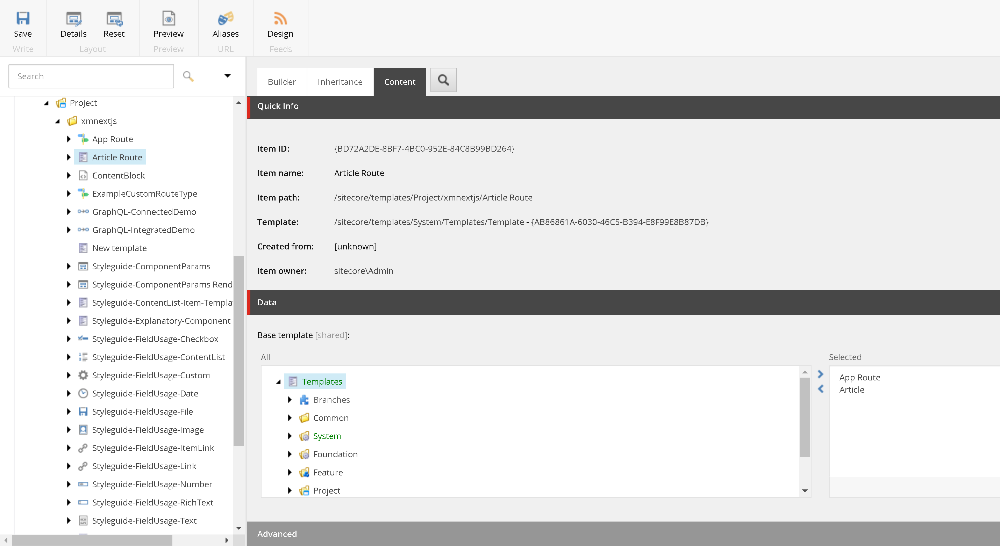

import { Callout } from 'nextra-theme-docs'

# Create a Sitecore Next.js Page
We will explore how to create pages in a Sitecore Next.js solution. Along the way we'll learn about Standard Values and how it enhances the content editing experience.

On our previous guide, we added Article fields to the home page, which is not a realistic scenario. Let us clean up and create a separate template solely for Articles.

## Clean up
### Remove Template inheritance
To remove the template inheritance. **Do not skip this step** - we will treat the /sitecore/templates/Project/xmnextjs/App Route template as the base template for all of our routes.

1. Navigate to /sitecore/templates/Project/xmnextjs/App Route
1. Content Tab > Base template
1. Double click Article from the right panel to remove it.
1. Save the template, and you'll receive a warning. Click Proceed

### Remove rendering from a page
1. Navigate to /sitecore/content/XmNextJs/home
1. Presentation > Details
1. Final Layout > click Edit
1. Controls > Select Article, click Remove
1. Click OK until all the modals are closed

## Create a page template
1. On the Content Editor, navigate to /sitecore/templates/Project/xmnextjs
1. Right click, insert, New Template
    1. Give it a template name "Article Route"
    1. Base template: Templates/Project/xmnextjs/App Route
    1. Click next
1. On the next page under location, select /sitecore/templates/Project/xmnextjs
1. On the newly created template, under the "Content" tab
    1. Select the previously created Article template under Feature

### Template Icon
Setting an icon is a great way to help Content Editors tell at a glance what type of template an item is.
1. Select the template you created (/sitecore/templates/Project/xmnextjs/Article Route)
1. On the main ribbon, Configure > Icon.
1. Feel free to select an icon of your choosing. For more icons, select More Icons.

### Standard Values
In Sitecore, Standard Values is a way to default values on a Sitecore Item. When you set values on a field on the Standard Values, all items with that template will have their field value
set to the value on the Standard Values field. 

To create a Standard Values,
1. On the templage you created, make sure you have the Builder tab selected
1. On the main ribbon, Builder > Options
1. Standard Values

1. A __Standard Values item is created underneath your template node. This is the template's Standard Values.

#### Standard Values Token
A Standard Values Token is a way to automatically fill in fields upon *creation* of an item.  It is important to note that the token is expanded *only* upon creation of an item.
If an item is created before a token is set on the Standard Values, the token would not be expanded and you'll see the unexpanded token value in the field.

We will use the *$name* token to automatically fill in the "Title" field with the name of the item being created.
1. On the template's Standard Values, in the "Title" field, enter *$name*

**More tokens**
| Token    | Description   |
|----------|---------------|
|$name     |The name of the item created|
|$id	|The ID of the item created|
|$parentid	|The ID of the parent of the item created|
|$parentname	|The name of the parent of the item created|
|$date	|The date (yyyyMMdd) of when the item is created|
|$time	|The time (HHmmss) of when the item is created|
|$now	|The date and time (yyyyMMddTHHmmss) of when the item is created|

#### Default Presentation
When creating templates, it is also helpful to set some default presentation so that Content Editors does not have to look and find the components manually for each item they create.

1. On the Standard Values Item, on the main ribbon, Click Presentation > Details
1. This time we're going to leave "Shared Layout" selected as we want this component across all item versions
1. For the layout, select xmnextjs Layout (we didn't have to do this on the home page before)
1. Still on the "Shared Layout", add the "Article" rendering as [you did before](/build/create-your-first-nextjs-component#add-rendering-to-a-page).
1. You should have something like:

#### Insert Options
Adding templates on Insert Options is a way to allow Content Editors to easily select templates when creating a new item.

1. On the main ribbon, Configure > Assign (under Insert Options)

1. Select your Article Route (make sure it's selected on the right side) and click OK

## Create page items
Now it is time to create some article pages.

1. Navigate to the home route /sitecore/content/XmNextJs/home
1. Right click on the home node, Insert > Article Route. If you don't have that option, [see insert options](/build/create-a-sitecore-nextjs-page#insert-options)

1. Call it "My first article page"
1. Notice that in the Title field, "My first article page" is automatically entered. This is because of the [$name token](/build/create-a-sitecore-nextjs-page#standard-values-token).
1. At this point publish all your changes in Sitecore
1. The url of the page corresponds to the item path minus the portions up to home. For example if the item path is `/sitecore/content/XmNextJs/home/My first article page`,
the url to the page (including the domain) is `https://www.xmnextjs.localhost/my-first-article-page`
    1. Notice that spaces are replaced by hyphens. Spaces actually also works but aren't as pretty
1. Create and publish a few more Article pages.
    1. Notice that you do not have to manually set a presentation each time as we've used Standard Values to default the presentation.
    1. Notice that you do not have to do any changes on Next.js as the component is already created.

<Callout>
    Knowledge check:  
    What is the Standard Values item?  
    What can we set on the Standard Values?  
    How does a page item path relate to the url?
</Callout>