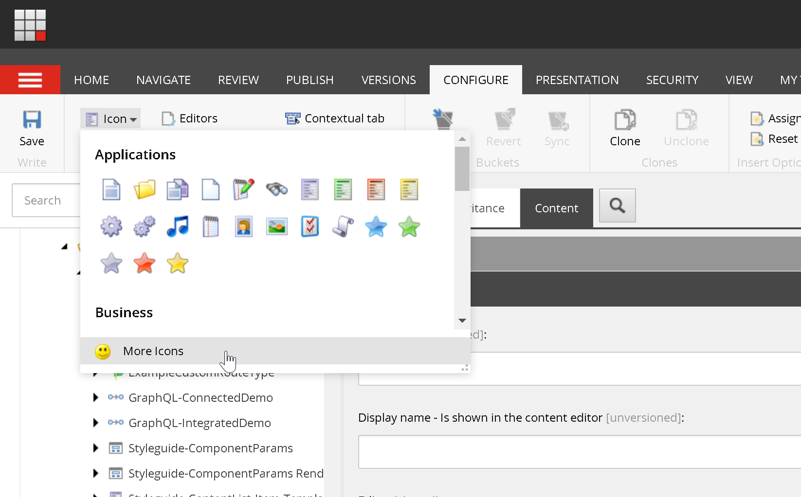

# Create a Sitecore Next.js Page

## Create a page template
1. On the Content Editor, navigate to /sitecore/templates/Project/xmnextjs
1. Right click, insert, New Template
    1. Give it a template name "Article Route"
    1. Base template: Templates/Project/xmnextjs/App Route
    1. Click next
1. On the next page under location, select /sitecore/templates/Project/xmnextjs
1. On the newly created template, under the "Content" tab
    1. Select the previously created Article template under Feature

### Template Icon
1. Select the template you created (/sitecore/templates/Project/xmnextjs/Article Route)
1. On the main ribbon, Configure > Icon. Feel free to select an icon of your choosing. For more icons, select More Icons.

### Standard Values
1. On the templage you created, make sure you have the Builder tab selected
1. On the main ribbon, Builder > Options
1. Standard Values

1. Select __Standard Values item underneath your template node. This is the template's Standard Values.

#### Standard Values Token
A Standard Values Token is a way to automatically fill in fields upon *creation* of an item.  It is important to note that the token is expanded *only* upon creation of an item.
If an item is created before a token is set on the Standard Values, the token would not be expanded and you'll see the unexpanded token value in the field.

We will use the *$name* token to utomatically fill in the "Title" field with the name of the item being created.
1. On the template's Standard Values, in the "Title" field, enter *$name*

**More tokens**
| Token    | Description   |
|----------|---------------|
|$name     |The name of the item created|
|$id	|The ID of the item created|
|$parentid	|The ID of the parent of the item created|
|$parentname	|The name of the parent of the item created|
|$date	|The date (yyyyMMdd) of when the item is created|
|$time	|The time (HHmmss) of when the item is created|
|$now	|The date and time (yyyyMMddTHHmmss) of when the item is created|

#### Default Presentation
1. On the Standard Value, enter 

#### Insert Options

## Create page items