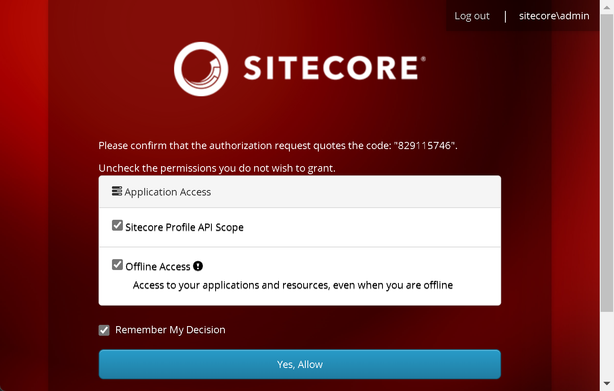
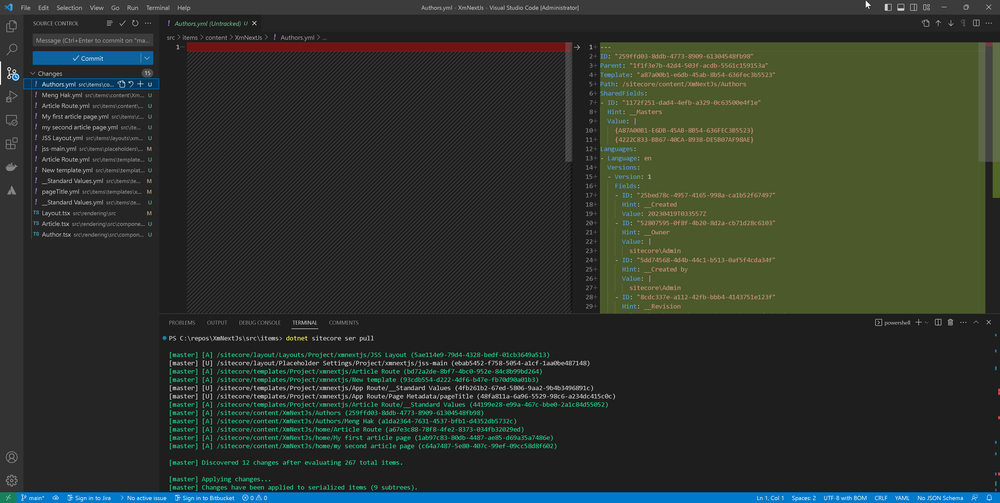

import { Callout } from 'nextra-theme-docs'

# Sitecore Content Serialization (SCS)

At this point, it is a good idea to learn about content serialization. As a quick refresher, content items lives in Sitecore databases: the master database for work in progress content,
and the web database for published content. Content serialization is the process of exporting content items and their associated media, templates, layouts, and other site-related information
from a Sitecore instance to a serialized format that can be easily transported and imported into another Sitecore instance. 

Content serialization is often used in development and deployment workflows to move content between different environments, such as from a local development environment to a testing or production environment. It is also useful
as a means to sync content between multiple developers. When working on a CMS site such Sitecore, you not only need the code to be in sync, but also the content. Content serialization provides a means for that
and you would check in the files just like you check in code to the source repository. The serialization format is typically YML, and there are several third party serialization tools available in Sitecore such as Unicorn and TDS.

Starting with Sitecore 10.0 initial, Sitecore introduced their own version called [Sitecore Content Serialization](https://doc.sitecore.com/xp/en/developers/101/developer-tools/sitecore-content-serialization.html).

## Authorize access
The first step to serializing content is to authorize access using the login command.

`dotnet sitecore login --authority https://<sitecore-identity-server> --cm https://<sitecore-instance> --allow-write true`

If you have been following our tutorial,
1. On C:\repos\XmNextJs, run the command:  
`dotnet sitecore login --authority https://id.xmnextjs.localhost --cm https://cm.xmnextjs.localhost --allow-write true`
1. The browser will open a Sitecore window asking you to login to Sitecore. Log in.
1. Click "Yes, Allow"


## Serialize content from the Sitecore database
We have created quite a few content items such as templates, renderings, and others. Let us serialize content from the database. We do this with the command:  
1. run `dotnet sitecore ser pull`


1. Noticed that SCS created yml files which represents each item in the Sitecore database onto the `src\items` directory. This is what should be checked in.

## Push content from serialized files into the Sitecore database
To do the reverse and push content from serialized files into the Sitecore database, we use the command:  
`dotnet sitecore ser push`

In a typical development work flow, you would
1. Get the latest code from a branch (typically develop)
1. Create a feature branch from the develop branch
1. Run `dotnet sitecore ser push`
1. This ensures that both code and content is in sync with other developers

## Sitecore Content Serialization configuration
How does Sitecore know which content items to serialize? Sitecore utilizes json files to control what content to serialize. In `C:\repos\XmNextJs\src`, notice there are 3 files `.modules.json`

```json filename="InitItems.module.json" showLineNumbers
{
    "namespace": "InitItems",
    "items" : {
        "includes": [
            {
                "name": "content-root",
                "path": "/sitecore/content",
                "scope": "singleItem",
                "allowedPushOperations": "createAndUpdate"
            },
            {
                "name": "api-key",
                "path": "/sitecore/system/Settings/Services/API Keys/XmNextJs",
                "scope": "singleItem"
            },
            {
                "name": "language",
                "path": "/sitecore/system/Languages/da-DK",
                "scope": "singleItem"
            }
        ]
    }
}
```

Learn more about [Sitecore Content Serialization configuration](https://doc.sitecore.com/xp/en/developers/101/developer-tools/sitecore-content-serialization-configuration-reference.html).

<Callout>
    Knowledge check:  
    What is content serialization?  
    What are some uses of content serialization?    
    How do we serialize content?  
    How do we push content to the Sitecore database?
</Callout>