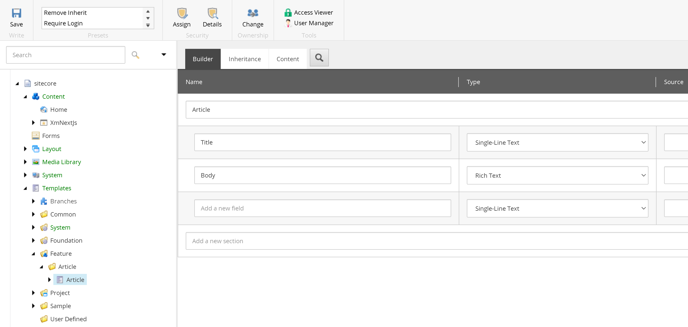
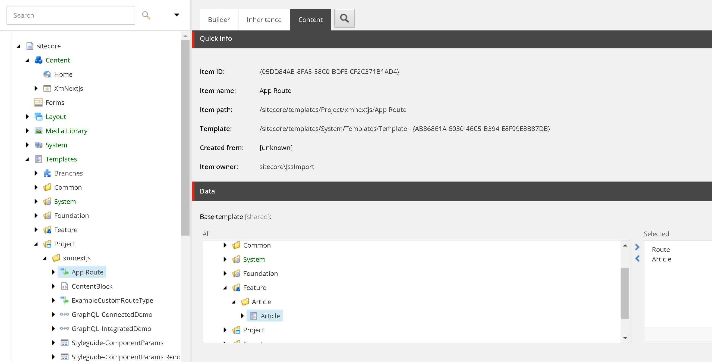
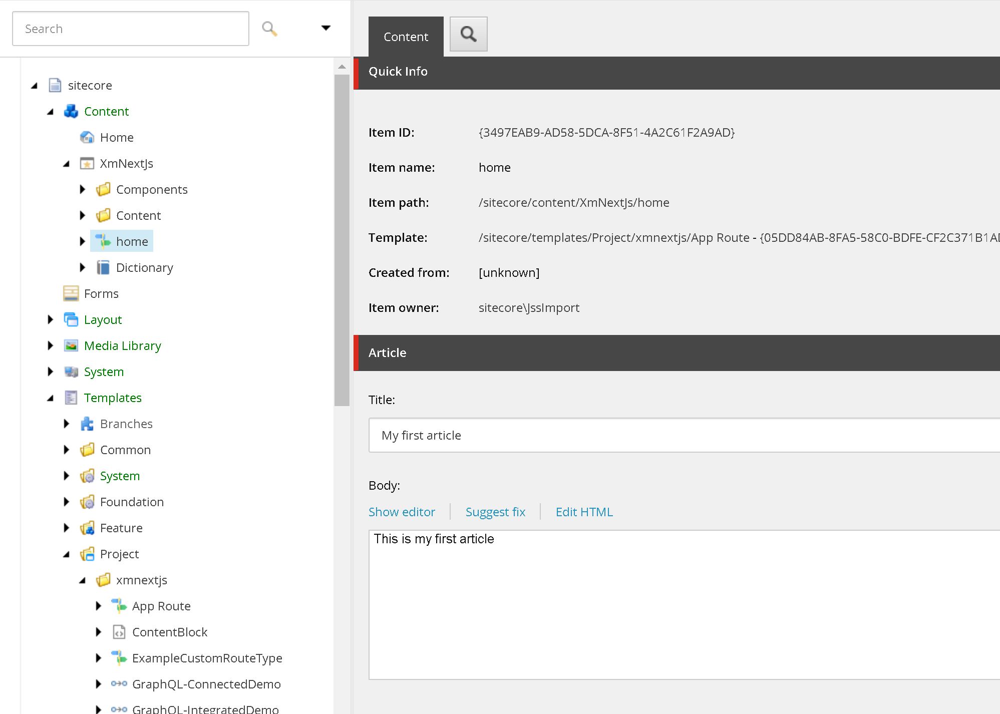

# Make your component content-editable
This will guide you on how to make your component content-editable. 

## Create a template
In the Content Editor

1. Navigate to /sitecore/templates/Feature
1. Create a Template Folder named "Article"
    1. Under Feature, right click, Insert > Template Folder
1. Create a template under that also named "Article"
    1. right click, Insert > Template
1. Add a new section named "Article"
1. Add fields
    1. Add a field named "Title" and type as Single-Line Text
    1. Add a field named "Body" and type as Rich Text



## Update the home template
We will utilize template inheritance to bring in fields from the template was just created onto the template used by the home page.
1. Navigate to /sitecore/templates/Project/xmnextjs/App Route
1. Click Content
1. Navigate to the "Article" template we created, and double click to select
1. Save

1. Navigate to the home item and enter some data.

1. Publish all your changes

## Verify the home route data
1. In Visual Studio Code, look in `src/rendering/scjssconfig.json` and copy the apiKey value.
1. In a browser, open `https://cm.xmnextjs.localhost/sitecore/api/layout/render/jss?item=/&sc_apikey={YOUR API KEY}&sc_mode=normal`
1. You should see something like below. If not, ensure you've published all items in Sitecore.

```json {8-13}
"route": {
    "name": "home",
    "displayName": "home",
    "fields": {
        "pageTitle": {
            "value": "Welcome to Sitecore JSS"
        },
        "Title": {
            "value": "My first article"
        },
        "Body": {
            "value": "This is my first article"
        }
    },
}
```
## Update component
In Visual Studio Code, update your component.

```tsx filename="article.tsx" showLineNumbers
import {
    Text,
    Field,
    RichText,
    useSitecoreContext
} from '@sitecore-jss/sitecore-jss-nextjs';

type ArticleFields = {
    Title: Field<string>;
    Body: Field<string>,
};

const Article = (): JSX.Element => {
    const { sitecoreContext } = useSitecoreContext();
    const fields = sitecoreContext.route?.fields as ArticleFields;

    return (
        <section>
            <Text tag="h1" field={fields.Title} />
            <RichText field={fields.Body} />
        </section>
    )
};

export default Article
```