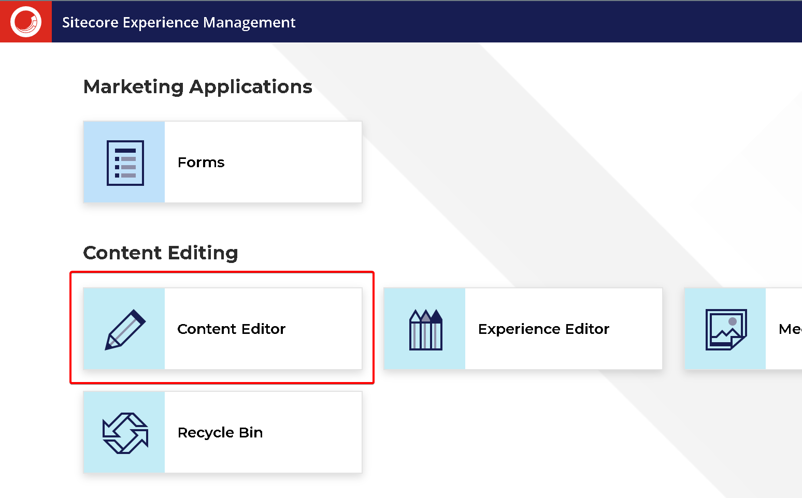

import { Callout } from 'nextra-theme-docs'

# Create a component
This will guide you in creating a simple component. The approach we will be using is the [Sitecore-first development workflow](https://doc.sitecore.com/xp/en/developers/hd/210/sitecore-headless-development/sitecore-first-development-workflow.html).
You will learn how to create a json rendering, verify the output, and create the next.js component attached to it.

## Log into Sitecore
First log onto your Content Management environment `https://cm.xmnextjs.localhost/sitecore` using user name: `admin` and the password
you entered on step 4.1 of [installing Sitecore](/environment/installing-and-running-the-sitecore-environment#installing).

Once you've logged on, you will see the launchpad. Click on the Content Editor.



## Create a rendering
1. Navigate to `/sitecore/layout/Renderings/Feature`
1. Create a rendering folder
    1. Right click, insert, and select **Rendering Folder**
    1. Name it "Article"
1. Create a json rendering
    1. Navigate to the Article folder you created
    1. Right click, insert, and select Json Rendering
    1. Name the rendering "Article" as well

At this point you should have something that looks like the below. Mentally note that the component name is also "Article" as specified under the "Component Name" field


## Add rendering to Placeholder Settings
The Placeholder Settings is a place where you specify what renderings content editors are allowed to place in a placeholder. We will add our newly created "Article"
to the list of renderings that the "Main" placeholder is allowed to have.

1. Navigate to `/sitecore/layout/Placeholder Settings/Project/xmnextjs/jss-main`.  
**Note**: you actually have to click on the `Main` item in Sitecore. This is because even though the item name is `jss-main`, the Display Name is `Main`.

1. Under **Allowed Controls**, click edit
1. Navigate to the Article component, and double click to select (alternatively, click the right arrow next to Selected)

1. Make sure "Article" is on the right side under **Selected**
1. Click OK
1. You will see that "Article" is now in the **Allowed Controls** field
1. On the main ribbon, click Save to save the **Main** Placeholder Setting item.

## Add rendering to a page
Now that you have created a rendering and specified where on the page the rendering are allowed to be placed in, let's add it to an actual page.
We will add the rendering to the home page.
1. Navigate to `/sitecore/content/XmNextJs/home`
1. On the main ribbon, make sure "home" is selected. Click Presentation > Details

1. Click on "Final Layout"
1. We see that ContentBlock is the only rendering currently on the home page

1. Click edit
1. Click Controls, then click Add
1. Navigate to Renderings/Feature/Article and select Article
1. Under "Add to Placeholder" enter `jss-main`. This was the placeholder that we allowed our rendering to be placed in.

1. Click Select
1. Click Move Up so that Article is now above ContentBlock and is the first component on the home page

1. Click OK, then Click OK to close all the dialogs.
1. Let's view our homepage
1. On the main ribbon, click Publish > Experience Editor. The Experience Editor is where we can preview and edit how our page looks.
1. In the Experience Editor, we see a warning. This is because we have not created our React/Next.js component that is tied to this rendering yet.


## Create the Next.js component
1. Open Visual Studio Code
1. Under `./rendering/src/components`, create a `Feature` folder, and under that create an `Article` folder.
1. Create a file and name it Article.tsx

1. Add code
```js
const Article = (): JSX.Element => (
    <section>
        <h1>My first article</h1>
        <div>Lorem ipsum dolor sit amet, consectetur adipiscing elit, sed do eiusmod tempor incididunt ut labore et dolore magna aliqua.</div>
    </section>
);

export default Article
```
Go back to the Experience Editor and we see that our component has rendered! Ignore the "Hello World" which was part of a previous lesson.


## Publish changes in Sitecore
Let's visit our rendering host site: https://www.xmnextjs.localhost/. Notice that we do not see our component.
This is because we have been working under the `master` database in Sitecore whereas the rendering host site is connected to the `web` database.
The Experience Editor provides a preview of our site.

To publish our site:
1. In the Content editor, main ribbon, Publish > Publish drop down > Publish Site
1. Select Smart Publish and all languages
1. Click Publish

<Callout>
    On a live site, the "Publish Site" option should rarely be used and "Publish Item" should be used instead. This is to prevent accidentally publishing
    content that an editor isn't ready to share to visitors.
</Callout>

## Summary
We created a Sitecore rendering, edit the placeholder settings to allow our new rendering to be added, added the rendering to a page, created the corresponding
Next.js component and publish the site.

Our component currently only has hardcoded content, which isn't useful to a content editor. In our next lesson, we will go over how to make the component
content-editable.