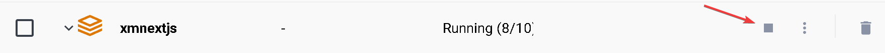

import { Callout } from 'nextra-theme-docs'

# Docker basics

If you have setup your sitecore environment by following the [previous guide](/environment/installing-and-running-the-sitecore-environment), your Docker Desktop should look like something below.
You may noticed that `solr-init-1` and `mssql-init-1` is stopped. This is normal as those containers are only used to setup your Solr and SQL environment respectively.


## docker compose stop
To stop your environment and free up resources on your computer, in Docker Desktop, click the **Stop** button under actions.


alternatively, back in VSCode, you can run
```
docker compose stop
```


If you try to visit your site (https://www.xmnextjs.localhost/), you will notice that it has stop working.

## docker compose start
To start your environment again, in Docker Desktop, click the **Start** button under actions.


alternatively, back in VSCode, you can run
```
docker compose start
```

<Callout type="warning">
    Make sure you're under the `.\run\sitecore-xm1` because that is where our [docker-compose.yml](https://docs.docker.com/compose/compose-file/) file lives
</Callout>


## docker compose down
To delete your environment, in Docker Desktop, click the **Delete** button under actions. Do not worry about deleting your docker environment -
it can easily be recreated by [docker compose up](/environment/working-in-a-docker-environment#docker-compose-up).


alternatively, back in VSCode, you can run
```
docker compose down
```


## docker compose up
After deleting your environment, you can create your environment again by running the command below. Notice the `-d` flag as we are running under detached mode i.e. running it in the background.
<Callout type="warning">
    Make sure you're under the `.\run\sitecore-xm1` because that is where our [docker-compose.yml](https://docs.docker.com/compose/compose-file/) file lives
</Callout>
```
docker compose up -d
```


## Learn more
Learn more about [docker compose](https://docs.docker.com/compose/reference/)