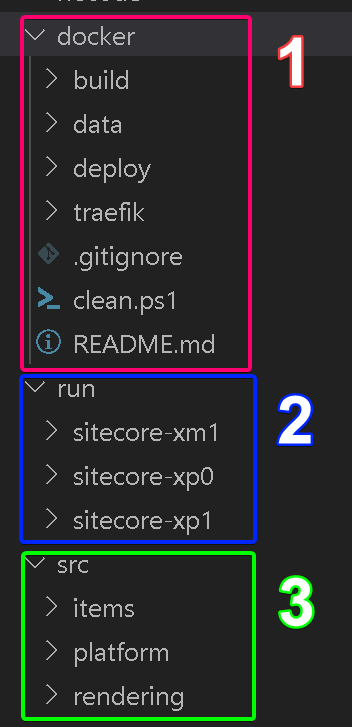

import { Callout } from 'nextra-theme-docs'

# Explore the solution
This section of the guide will give you an overview of the Sitecore XM Next.js code repository solution.  

The repository of the solution contains the following items:
1. Docker configurations for docker builds and mounts
2. Docker compose to run your environment
3. A `src` directory that contains everything you need that is specific to your solution.
    1. Sitecore items serialization
    2. Sitecore specific code and configuration 
    3. Next.js application to render your website

Take note that rather than having separate repositories for configuration, Sitecore, and Next.js, 
all of the source code is within this single repository. This is by design; this is to prevent having to sync different versions across multiple repositories.
  

<Callout>
    Most developers will only need to work under Section 3 `src` directory.
</Callout>

