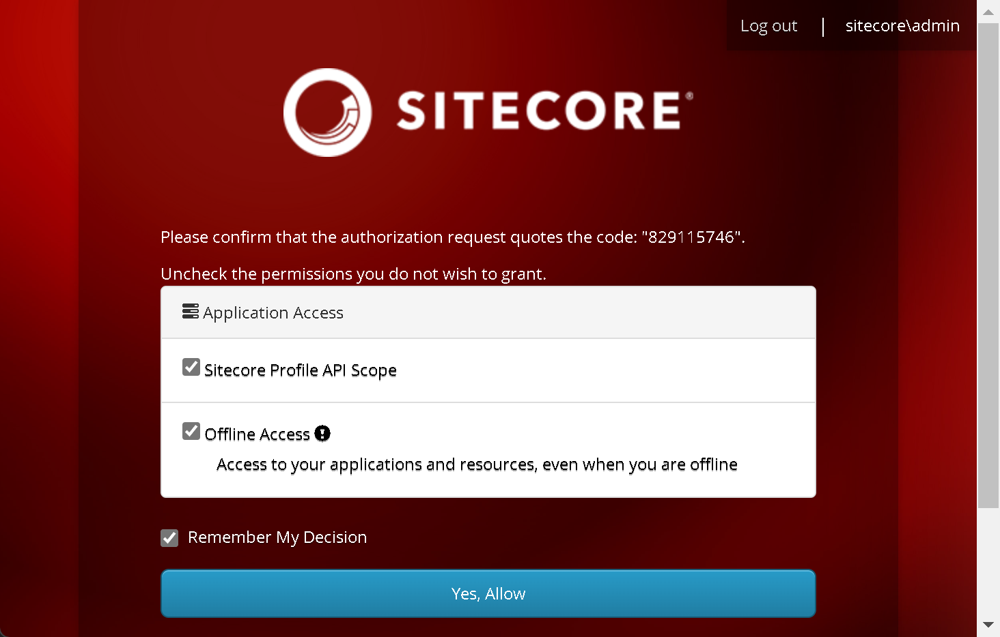

import { Callout } from 'nextra-theme-docs'

# Installing and running the Sitecore environment
This will guide you with installing Sitecore XM and Next.js in a docker container environment.
The beauty with using docker is that you do not have to download and install Sitecore, Solr, SQL, etc manually;
docker will take care of that for you.  

If you haven't already, install the [prerequisites](/environment/prerequisites).

## Clear ports
In order to run Sitecore with docker, ports 443 and 8984 must be free as Sitecore uses those ports for SSL and Solr respectively.

1. Stop port 443, stop IIS by running `iisreset /stop`. Note: this will stop all websites running on IIS on your machine.

2. Stop any Solr services running on port 8984
    1. In powershell, check what's using the port by running
    ```
    Get-Process -Id (Get-NetTCPConnection -LocalPort 8984).OwningProcess
    ```
    2. If you get the error below, there's nothing running on port 8984 and you're good to go.
    ```
    Get-NetTCPConnection : No MSFT_NetTCPConnection objects found with property 'LocalPort' equal to '8984'. Verify the value of the property and retry.
    ```
    3. If it does return a process, run the below to stop the service.
        * In cmd, run `Stop-Service -Name "the name of your service"`
        * or if using nssm, run `nssm stop "the name of your service"`

## Installing
1. In powershell, navigate to a directory e.g. c:\repos
2. Run `dotnet new sitecore.nextjs.gettingstarted -n XmNextJs` (replace XmNextJs with your own project name)
    1. You will encounter a few prompts regarding dotnet restore, powershell, SSG, etc. If you're familiar with these settings, feel free to change these as you need. In this case, we'll leave select all of the default choices.
    
3. Once done, use Visual Studio Code to open your new project e.g. c:\repos\XmNextJs
4. Open a new terminal
    
    1. run `.\init.ps1 -InitEnv -Topology "xm1" -LicenseXmlPath "path\to\license.xml" -AdminPassword "yourpasswordhere"`
    <Callout type="warning">
        Change `path\to\license.xml` with the correct path to your license.
    </Callout>
    <Callout type="warning">
        Change `yourpasswordhere` with a password of your choosing.
        You will need this for step 7.
    </Callout>
    
    
    
5. Once the `.\init.ps1` script finishes, execute the command that is mentioned at the end. This will add SSL cert.
    
    ```
    setx NODE_EXTRA_CA_CERTS C:\Users\{yourusername}\AppData\Local\mkcert\rootCA.pem
    ```
    <Callout type="warning">
        Change `{yourusername}` with your windows user name.
    </Callout>
6. Restart Visual Studio Code
7. At the time of this writing, there is a bug in the docker compose, which we will fix.
    1. Open up C:\repos\XmNextJs\run\sitecore-xm1\docker-compose.override.yml
    2. Place an extra backslash to the entrypoints
    ```
    entrypoint: powershell.exe -Command "& C:\\tools\\entrypoints\\iis\\Development.ps1"
    ```
    
7. Make sure you're running Docker for Windows
8. Make sure you [clear ports](/environment/installing#clear-ports) before proceeding
9. We should now be ready to execute the powershell script that will download container images and build your environment. This process may take a while.
    1. Run `.\up.ps1` 
    
10. The CM server will prompt you to log into sitecore.
    1. Enter `admin` as the user name and the password you specified on step 3.11. 
    2. Click Yes, Allow
    
11. When the script finishes, it will launch the Content Management (**CM**) instance.
    After a bit of time, (after the Content Delivery instance warms up) you should be able to visit your **rendering host** e.g. https://www.xmnextjs.localhost
    