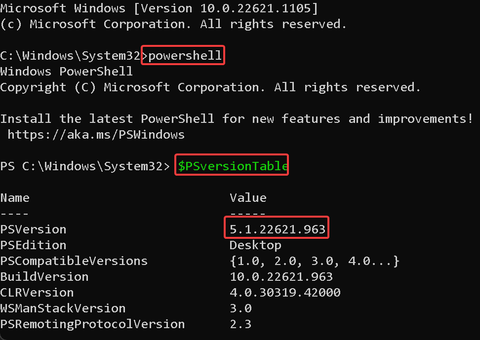
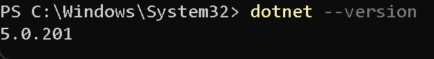
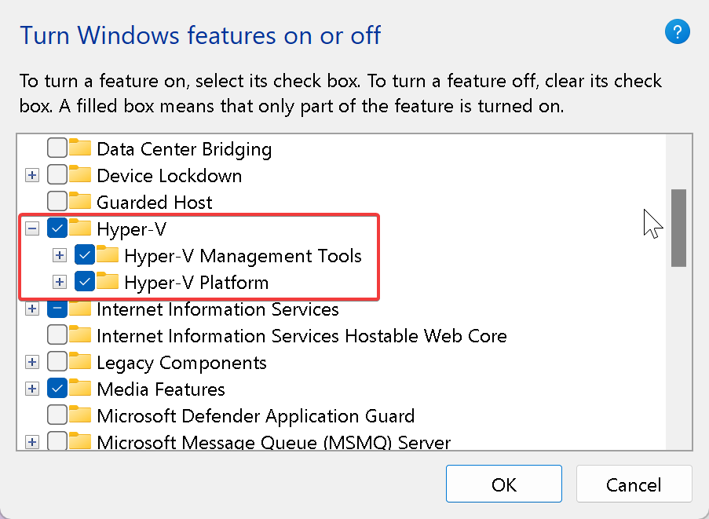
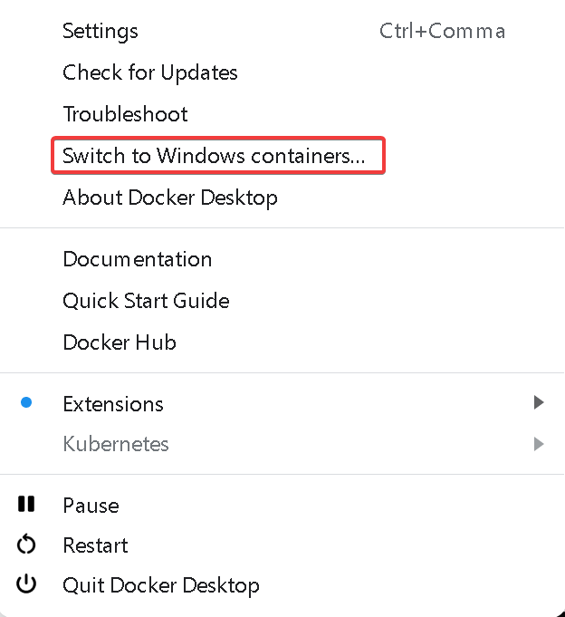

import { Callout } from 'nextra-theme-docs'

This will guide you with installing Sitecore XM and Next.js in a docker container environment.
The beauty with using docker is that you do not have to download and install Sitecore, Solr, SQL, etc manually;
docker will take care of that for you.

## Prerequisites
In order to run the Sitecore XM environment in a docker container, install and verify that you have all the necessary programs.

<Callout type="warning">
    You will also need a valid Sitecore license.
</Callout>

1. **Powershell 5.1** - comes bundled with Windows 10 so you do not have to download and install.
    * **Verify**
        1. In Command Prompt, run `powershell`
        2. Run `$PSversionTable`
        
2. **.NET Core 3.1** or later
    * [Download and install .Net 3.1](https://dotnet.microsoft.com/download/dotnet-core/3.1)
    * **Verify**
        1. In cmd run `dotnet --version`
        
3. **.Net Framework 4.8**
    * [Download and install .Net Framework 4.8](https://dotnet.microsoft.com/download/dotnet-core/3.1)
    * **Verify**
        1. In Powershell run
        ```
        (Get-ItemProperty "HKLM:\SOFTWARE\Microsoft\NET Framework Setup\NDP\v4\Full").Release -ge 528040
        ```
        If it returns true, that means 4.8 is installed. [More info on how to determine .Net Framework version](https://docs.microsoft.com/en-us/dotnet/framework/migration-guide/how-to-determine-which-versions-are-installed)
4. **Docker for windows**
    1. Enable **Hyper-V**
        1. On Windows search, type "Turn on Windows features on or off"
        2. Enable Hyper-V
        
    1. Download and install [docker](https://docs.docker.com/docker-for-windows/install/)
    1. Run Docker Desktop
    2. Switch to windows containers
        1. Open the windows system tray, and right click on Docker Desktop
        2. Click "Switch to windows containers…"
        
5. **Node.js**
    1. For node.js, I like to use [NVM for windows](https://github.com/coreybutler/nvm-windows), which will allow you to easily switch node versions
    2. To use NVM, uninstall any pre-existing node installations, otherwise there will be conflict
    3. [Download NVM for windows](https://github.com/coreybutler/nvm-windows/releases/download/1.1.9/nvm-setup.exe)
    4. To use node lts
        1. Install lts: `nvm install lts`
        2. Switch to lts: `nvm use lts`
    5. **Verify**
        1. In cmd, `npm -v`
6. **Sitecore template**
    1. Install Sitecore template
    ```
    dotnet new -i Sitecore.DevEx.Templates --nuget-source https://sitecore.myget.org/F/sc-packages/api/v3/index.json
    ```
