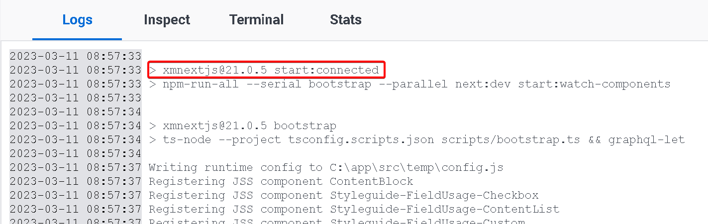
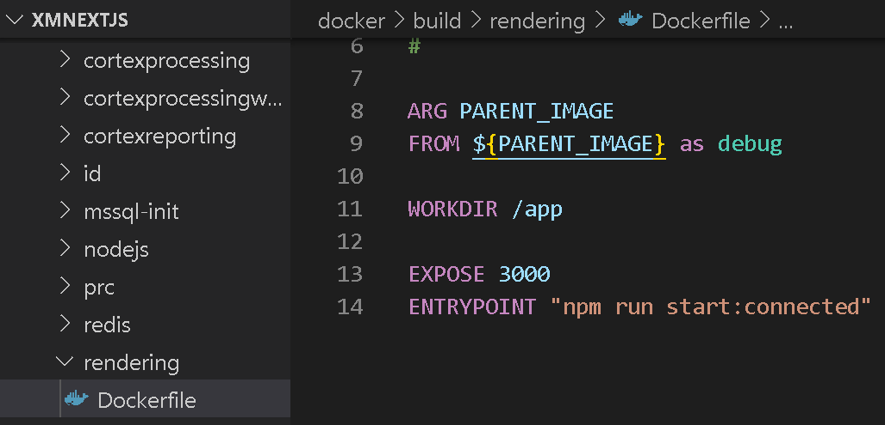
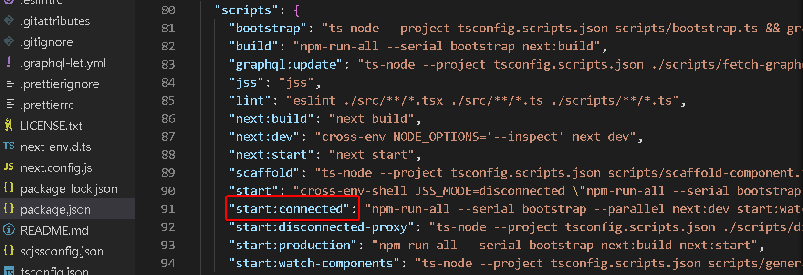
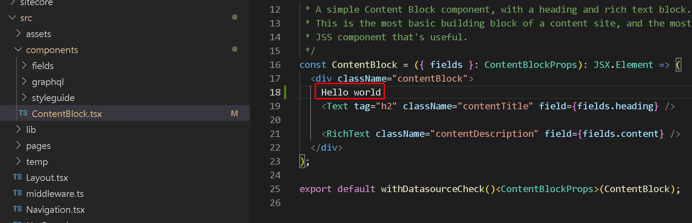
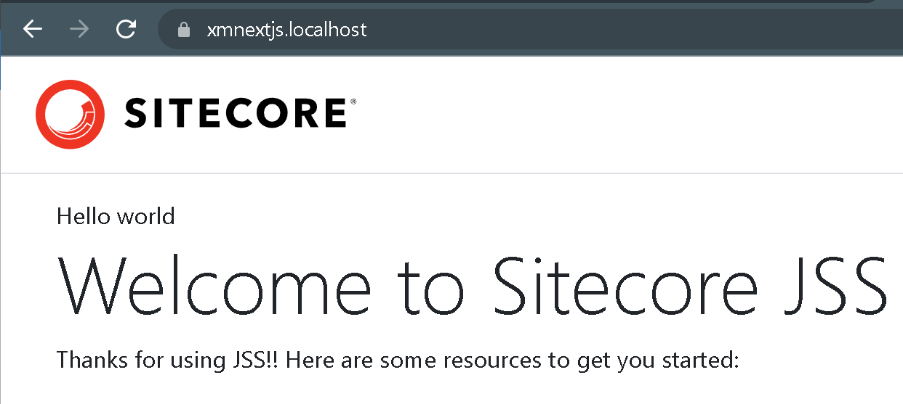
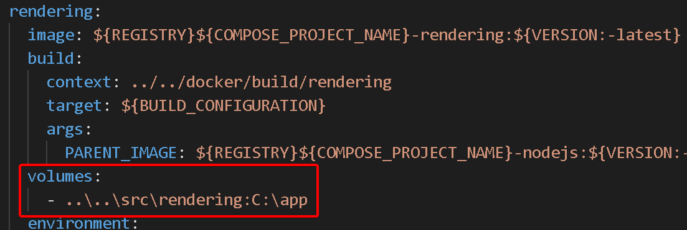
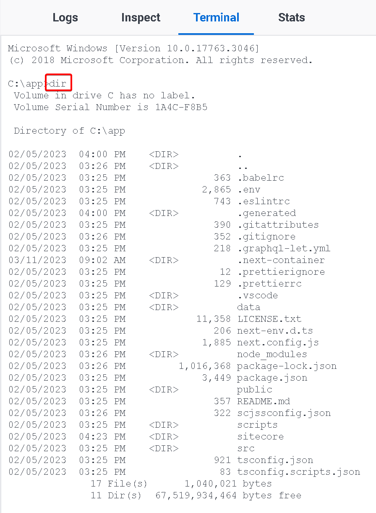

import { Callout } from 'nextra-theme-docs'

# Working in a docker environment

This portion of the guide is meant to help you familiarize with working in a docker environment.

Your Docker Desktop should look like:


If your environment is stopped, in Docker Desktop, click on the play icon on the xmnextjs row to start or in Visual Studio Code, on the `.\run\sitecore-xm1\` directory run

```
docker compose start
```

alternatively, if your environment was removed

```
docker compose up -d
```

## Container logs
The container logs is useful in troubleshooting and see what is running on a particular container.

Let's see what is happening on our node application. On Docker Desktop, click on `rendering-1`.
Scroll all the way to the top of the log, and you'll see that it is running Sitecore in connected mode.



The container knows to run this since it is a defined entrypoint in the dockerfile at `.\docker\build\rendering\Dockerfile`


This npm command corresponds to the package.json defined at `.\src\rendering\package.json`


## Folder mounts
We will alter a component and see how it gets updated on your environment.

Open the file `.\src\rendering\src\components\ContentBlock.tsx` and make a small change.


If you visit your site(https://www.xmnextjs.localhost/ if you are following along), you will see that the change gets reflected right away.
This is because of the `start:connected` command that was executed by the entrypoint.
There is no need to run the same command on your Visual Studio Code as the container already does it and is watching for changes in your rendering directory.


We will see how our rendering directory corresponds to the container. Open the file `.\run\sitecore-xm1\docker-compose.override.yml`.
We see that our `.\src\rendering` folder mounts to the `c:\app` folder in the container.


Back on Docker Desktop, click on the `rendering-1` container and Terminal tab. List out the directory by typing `dir`.
We see the same contents as our `.\src\rendering` folder.

