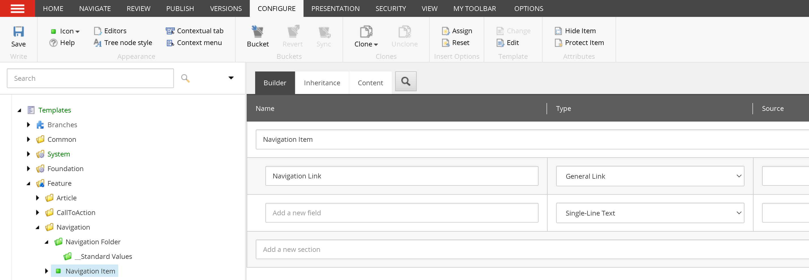
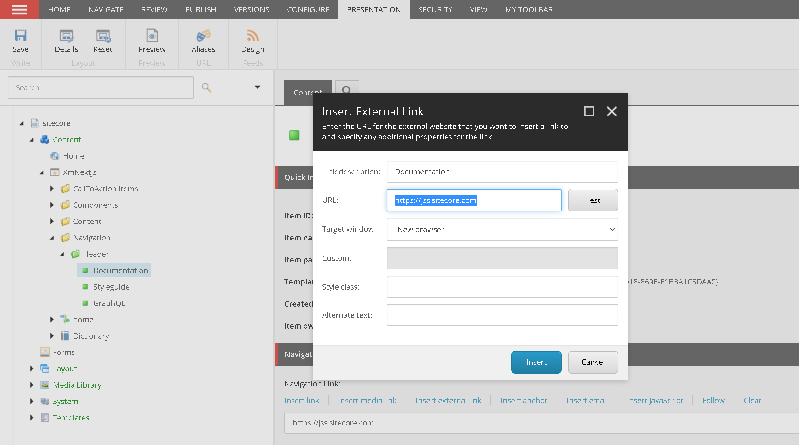
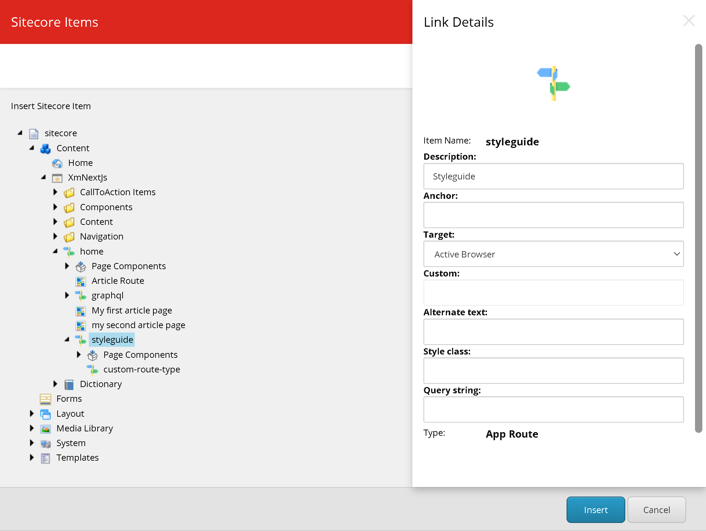
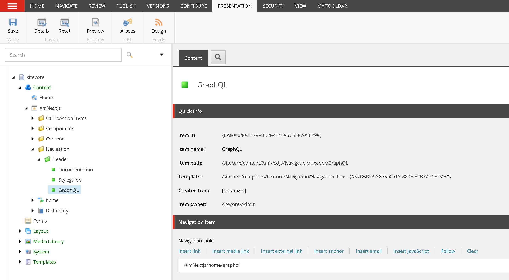

# Build content editable navigation items
If we take a look at our `Navigation` component, notice that each link is hardcoded.
```tsx filename="rendering\src\Navigation.tsx" {11-24}
...
<div className="d-flex flex-column flex-md-row align-items-center p-3 px-md-4 mb-3 bg-white border-bottom">
    <h5 className="my-0 mr-md-auto font-weight-normal">
    <Link href="/">
        <a className="text-dark">
            
        </a>
    </Link>
    </h5>
    <nav className="my-2 my-md-0 mr-md-3">
        <a
            className="p-2 text-dark"
            href="https://jss.sitecore.com"
            target="_blank"
            rel="noopener noreferrer"
        >
            {t('Documentation')}
        </a>
        <Link href="/styleguide">
            <a className="p-2 text-dark">{t('Styleguide')}</a>
        </Link>
        <Link href="/graphql">
            <a className="p-2 text-dark">{t('GraphQL')}</a>
        </Link>
    </nav>
</div>
...
```
Let us move all of that data into Sitecore so that content editors can add, edit, and remove the links. We will utilize the `General Link` field for this.

## Create navigation templates
Create Sitecore templates for the navigation items.
1. Navigate to `/sitecore/templates/Feature`
1. Create a Template folder and call it `Navigation`
1. Create a `Navigation Folder` template. It's purpose is to hold navigation items.
    1. Under the `Navigation` folder you just created, right click > Insert New Template 
        1. Name: `Navigation Folder`
        1. Base Template: `Templates/Common/Folder`
1. Create a `Navigation Item` template.
    1. Under the `Navigation` folder, right click > Insert New Template
        1. Name: `Navigation Item`
        1. Base Template: `Templates/System/Templates/Standard template`
    1. For template section enter `Navigation Item`
    1. Create a template field `Navigation Link` of the type `General Link`
1. Back on the `Navigation Folder` item
    1. Create Standard Values
    1. Under the Standard Values, add the `Navigation Item` to the insert options.
1. Set icons for both the `Navigation Folder` and `Navigation Item` if you desire.

Your templates should look something like:


## Create navigation items
From the navigation templates, we will create navigation items.
1. Navigate to `/sitecore/content/XmNextJs`
1. Create a folder and call it `Navigation`
1. Under that folder, right click > Insert from Template
    1. Select your `/Feature/Navigation/Navigation Folder`
    1. Name it `Header`
1. Create Navigation items
    1. Create a navigation item under `Header` and call it `Documentation`
        1. Under the `Navigation Link`, click `Insert external link`
        1. Link description: `Documentation`. *This is what is going to be rendered between the anchor tag.*
        1. URL: `https://jss.sitecore.com`
        
    1. Create another `Navigation Item` named `Styleguide`
        1. Under the `Navigation Link`, click `Insert link`.
        1. Select the `/sitecore/content/XmNextJs/home/styleguide` item
        1. Description: `Styleguide`. *This is what is going to be rendered between the anchor tag.*
        
    1. Create another `Navigation Item` named `GraphQL`
        1. Under the `Navigation Link`, click `Insert link`
        1. Select the `/XmNextJs/home/graphql` item
        1. Description: `GraphQL`.
        
Your items should look something like:


Now that we have some navigation items, let's take a look at how to query the items.