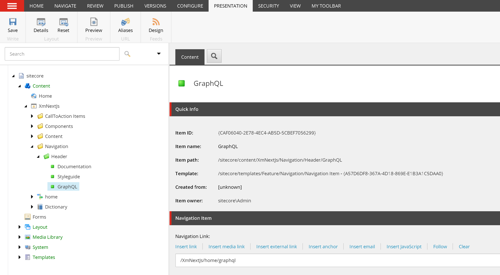

import { Callout, Steps } from 'nextra-theme-docs'

# Build a Sitecore Next.js component using GraphQL connected mode

Connected GraphQL in Sitecore executes GraphQL queries directly against the `Sitecore GraphQL endpoint`. In contrast to the integrated GraphQL, this is an *additional* call -
one to the `Layout Service` (to get data about datasource/page item data) and one to the Sitecore GraphQL endpoint for your component data.


In this guide, we will learn how to build a Sitecore Next.js component using GraphQL in connected mode. We will build a main navigation so that it pulls data from Sitecore. 

If you haven't already, make sure you've [created the navigation items](/graphql/build-content-editable-navigation-items). Also, see how  we've [tested and build our GraphQL query](/graphql/xgraph-browser#build-graphql-query).

Our navigation items has the following structure:


And our GraphQL query (**note** we've changed the query name):
``` graphql filename="QUERY"
query MainNavigationConnectedQuery($datasource: String!, $language: String!) {
  datasource: item(path: $datasource, language: $language) {
    id
    name
    children {
      results {
        id
        name
        ... on NavigationItem {
          navigationLink {
            jsonValue
          }
        }
      }
    }
  }
}
```

## Create Navigation Json rendering
In the Content Editor,

1. Navigate to /sitecore/layout/Renderings/Feature and create a `Navigation` rendering folder if it hasn't been created yet
1. Under the `Navigation` folder, create a Json rendering `MainNavigationConnected`
1. On the `MainNavigationConnected` item, set fields
    1. `Datasource Location`: /sitecore/content/XmNextJs/Navigation
    1. `Datasource Template`: /sitecore/templates/Feature/Navigation/Navigation Folder

<Callout>
  In contrast to the Integrated mode, we do not enter the GraphQL into `Component GraphQL Query` here.
</Callout>

## Layout clean up
Skip to [placeholder updates](#placeholder-updates), if you did this previously in the Integrated mode excercise.  

If you did not do the [layout cleanup](/graphql/integrated-mode#layout-clean-up) from the Integrated mode excercise, we'll have to update the `src\rendering\src\Layout.tsx`.
Notice that the `Navigation` component is outside of the `jss-main` placeholder. We'll need to clean this up and add a placeholder to hold our new `MainNavigationComponent` rendering.

``` tsx filename="src\rendering\src\Layout.tsx" {9}
return (
    <>
      <Scripts />
      <Head>
        <title>{fields.pageTitle.value.toString() || 'Page'}</title>
        <link rel="icon" href={`${publicUrl}/favicon.ico`} />
      </Head>

      <Navigation />
      {/* root placeholder for the app, which we add components to using route data */}
      <div className="container">{route && <Placeholder name="jss-main" rendering={route} />}</div>
    </>
  );
```

1. Remove the `Navigation` component
1. Add a `jss-header` placeholder
1. While we're here, let's make our HTML more semantic
    1. Wrap the `jss-header` placeholder with `<header>`
    1. Change `div.container` to `main.container`

``` tsx filename="src\rendering\src\Layout.tsx" {9-11,13}
return (
  <>
    <Scripts />
    <Head>
      <title>{fields.pageTitle.value.toString() || 'Page'}</title>
      <link rel="icon" href={`${publicUrl}/favicon.ico`} />
    </Head>

    <header>
      {route && <Placeholder name="jss-header" rendering={route} />}
    </header>
    {/* root placeholder for the app, which we add components to using route data */}
    <main className="container">{route && <Placeholder name="jss-main" rendering={route} />}</main>
  </>
);
```

## Placeholder updates
We previously learned the steps necessary to [add a placeholder](/build/add-placeholders-in-sitecore-nextjs) - we'll have to do the same steps here for our `jss-header` placeholder.  

In the Content Editor,
1. Update the `jss-header` placeholder setting to allow the `MainNavigationConnected` rendering.
    1. Navigate to `/sitecore/layout/Placeholder Settings/Project/xmnextjs/jss-header`
    1. Under the `Allowed Controls`, add `MainNavigationConnected` 
    
1. Update the `xmnextjs Layout` to render `jss-header` data. *This was previously done on the integrated mode excercise*.
    1. Navigate to `/sitecore/layout/Layouts/Project/xmnextjs/xmnextjs Layout`
    1. Under `Layout Service Placeholders` field, add `jss-header`

## Add rendering
We would like to add the `MainNavigationConnected` rendering to every page. It is generally a good idea to create a base page template and have other page
templates inherit from this template. Fortunately for us, in our [create a page template](/build/create-a-sitecore-nextjs-page#create-a-page-template) tutorial,
we decided to use the `App Route` as our base template (Article Route inherits from this template). We'll continue to do the same.

1. Navigate to `/sitecore/templates/Project/xmnextjs/App Route/__Standard Values`. *Create the Standard Values, if it wasn't already created.*
1. Under `Presentation > Details > Shared Layout`, change the `MainNavigationIntegrated` rendering to the `MainNavigationConnected` rendering, keeping the same placeholder and data source.
    1. `Placeholder`: jss-header
    1. `Data Source`: /sitecore/content/XmNextJs/Navigation/Header

In Sitecore, publish our changes.

## Layout Service
Let's check our `Layout Service` and see what gets returned.

In a browser, open `https://cm.xmnextjs.localhost/sitecore/api/layout/render/jss?item=/&sc_apikey={YOUR API KEY}&sc_mode=normal`


``` json showLineNumbers {9-13}
{
	"sitecore": {
    ...
		"route": {
			"placeholders": {
				...
				"jss-header": [
					{
						"uid": "b1e781a3-a93a-42e5-8ae5-fb3feefbf6a9",
						"componentName": "MainNavigationConnected",
						"dataSource": "{2CD2AB0A-034B-474A-891B-87F8B883C0A8}",
						"params": {},
						"fields": {}
					}
				]
			}
		}
	}
}
```
<Callout>
  In contrast to the integrated mode, the layout service does not contain your GraphQL data.
</Callout>

## GraphQL Types Update
Since GraphQL is strongly typed, we'll need to let the Next.js application know about the `Navigation Item` template we've created.

<Steps>
### Publish Sitecore templates
Publish the Sitecore templates so that they are available on the web database

### Update introspection data
On `src/rendering` directory execute the command:  

`jss graphql:update`  

This will update `src\rendering\src\temp\GraphQLIntrospectionResult.json` with data about the `Navigation Item`.
</Steps>

## Create GraphQL

<Steps>
### Create the GraphQL file
Under the `src\components\Feature\Navigation` folder create a `MainNavigationConnectedQuery.graphql` file and paste in the query we created.

``` graphql filename="src\rendering\src\components\Feature\Navigation\MainNavigationConnectedQuery.graphql"
query MainNavigationConnectedQuery($datasource: String!, $language: String!) {
  datasource: item(path: $datasource, language: $language) {
    id
    name
    children {
      results {
        id
        name
        ... on NavigationItem {
          navigationLink {
            jsonValue
          }
        }
      }
    }
  }
}
```

### Generate types
We'll need to regenerate the types so that our tsx files are aware of the `NavigationItem` template. On `src/rendering` execute:

`npm run bootstrap`

You should see a `MainNavigationConnectedQuery.graphql.d.ts` type file generated on same directory as your GraphQL file.  


Alternatively, restarting your `rendering host` application will also generate the types.
</Steps>

## Create component
We are now ready to create our Main Navigation component using GraphQL in connected mode.


<Steps>
### Create a type
Create a type that corresponds to our expect GraphQL return.
``` tsx filename="src\rendering\src\components\Feature\Navigation\MainNavigationConnected.tsx"
import {
    NavigationItem,
} from './MainNavigationConnectedQuery.graphql';

type NavigationData = {
  id: string,
  name: string,
  children: {
    results: Array<NavigationItem>
  }
}
```

### Add HTML
Add some HTML. Note that we're not rendering the navigation items just yet.

``` tsx filename="src\rendering\src\components\Feature\Navigation\MainNavigationConnected.tsx" {13-28}
import {
    NavigationItem,
} from './MainNavigationConnectedQuery.graphql';

type NavigationData = {
  id: string,
  name: string,
  children: {
    results: Array<NavigationItem>
  }
}

const MainNavigationConnected = (): JSX.Element => {
  return (
    <div className="d-flex flex-column flex-md-row align-items-center p-3 px-md-4 mb-3 bg-white border-bottom">
      <h5 className="my-0 mr-md-auto font-weight-normal">
        <a className="text-dark" href="/">
          
        </a>
      </h5>
      <nav className="my-2 my-md-0 mr-md-3">
        {/* nav here */}
      </nav>
    </div>
  );
};

export default MainNavigationConnected;
```

### Use GraphQL to get data
``` tsx showLineNumbers filename="src\rendering\src\components\Feature\Navigation\MainNavigationConnected.tsx" {1-4, 6, 33-54}
import {
  GetStaticComponentProps,
  GraphQLRequestClient,
} from '@sitecore-jss/sitecore-jss-nextjs';
import {
    MainNavigationConnectedQueryDocument,
    NavigationItem,
} from './MainNavigationConnectedQuery.graphql';

type NavigationData = {
  id: string,
  name: string,
  children: {
    results: Array<NavigationItem>
  }
}

const MainNavigationConnected = (): JSX.Element => {
  return (
    <div className="d-flex flex-column flex-md-row align-items-center p-3 px-md-4 mb-3 bg-white border-bottom">
      <h5 className="my-0 mr-md-auto font-weight-normal">
        <a className="text-dark" href="/">
          
        </a>
      </h5>
      <nav className="my-2 my-md-0 mr-md-3">
        {/* nav here */}
      </nav>
    </div>
  );
};

/**
 * Will be called during SSG
 * @param {ComponentRendering} rendering
 * @param {LayoutServiceData} layoutData
 * @param {GetStaticPropsContext} context
 */
export const getStaticProps: GetStaticComponentProps = async (rendering, layoutData) => {
    const graphQLClient = new GraphQLRequestClient(config.graphQLEndpoint, {
      apiKey: config.sitecoreApiKey,
    });
  
    const result = await graphQLClient.request<NavigationData>(
      // eslint-disable-next-line @typescript-eslint/no-explicit-any
      MainNavigationConnectedQueryDocument as any,
      {
        datasource: rendering.dataSource,
        language: layoutData?.sitecore?.context?.language,
      }
    );
  
    return result;
};

export default MainNavigationConnected;
```

For Server Side Rendering, replace `getStaticProps` with `getServerSideProps`.
```tsx
import {
  getServerSideProps,
} from '@sitecore-jss/sitecore-jss-nextjs';

export const getServerSideProps: GetServerSideComponentProps = async (rendering, layoutData) => {

  const graphQLClient = new GraphQLRequestClient(config.graphQLEndpoint, {
    apiKey: config.sitecoreApiKey,
  });

  const result = await graphQLClient.request<NavigationData>(
    // eslint-disable-next-line @typescript-eslint/no-explicit-any
    MainNavigationConnectedQueryDocument as any,
    {
      datasource: rendering.dataSource,
      language: layoutData?.sitecore?.context?.language,
    }
  );

  return result;
};
```

The `MainNavigationConnectedQueryDocument` type can be found the under the generated type file. The `MainNavigationConnectedQueryDocument` type contains properties to pass to the GraphQL query.

```ts file="MainNavigationConnectedQuery.graphql.d.ts"
export declare const MainNavigationConnectedQueryDocument: DocumentNode<MainNavigationConnectedQueryQuery, Exact<{
    datasource: Scalars['String'];
    language: Scalars['String'];
}>>;
```

### Confirm data
Visit your home page and confirm the GraphQL call `_next/data/development/en.json`


### Map and render data
Once we've confirmed that the data returns, let's map and render our data.  We'll do some clean up as well.

``` tsx showLineNumbers filename="src\rendering\src\components\Feature\Navigation\MainNavigationConnected.tsx" {1, 4, 6, 12-13, 22-24, 26-28, 38-56, 69-71, 88}
import { Link } from '@sitecore-jss/sitecore-jss-nextjs'
import {
    GetStaticComponentProps,
    constants,
    GraphQLRequestClient,
    withDatasourceCheck,
  } from '@sitecore-jss/sitecore-jss-nextjs';
import {
    MainNavigationConnectedQueryDocument,
    NavigationItem,
} from './MainNavigationConnectedQuery.graphql';
import config from 'temp/config';
import { ComponentProps } from 'lib/component-props';

type NavigationData = {
  id: string,
  name: string,
  children: {
    results: Array<NavigationItem>
  }
}
type MainNavigationProps = ComponentProps & {
    datasource: NavigationData
}

const MainNavigationConnected =(props: MainNavigationProps): JSX.Element => {
  // loop through the datasource children and grab all the jsonValues
  let navigationItems = props.datasource?.children.results.map(i => i.navigationLink?.jsonValue);

  return (
    <div className="d-flex flex-column flex-md-row align-items-center p-3 px-md-4 mb-3 bg-white border-bottom">
      <h5 className="my-0 mr-md-auto font-weight-normal">
        <a className="text-dark" href="/">
          
        </a>
      </h5>
      <nav className="my-2 my-md-0 mr-md-3">
        {/* 
          The Link component expects an object on the field property with the structure
              "value": {
                "href": "...",
                "text": "...",
                "linktype": "...",
                "url": "...",
                "anchor": "...",
                "target": "..."
              }
        */}
        { navigationItems && navigationItems.map((item, index) => (
            <Link
              key={index}
              field={item}
              className='p-2 text-dark'
            />
          ))
        }
      </nav>
    </div>
  );
};

/**
 * Will be called during SSG
 * @param {ComponentRendering} rendering
 * @param {LayoutServiceData} layoutData
 * @param {GetStaticPropsContext} context
 */
export const getStaticProps: GetStaticComponentProps = async (rendering, layoutData) => {
    if (process.env.JSS_MODE === constants.JSS_MODE.DISCONNECTED) {
      return null;
    }
    const graphQLClient = new GraphQLRequestClient(config.graphQLEndpoint, {
      apiKey: config.sitecoreApiKey,
    });
  
    const result = await graphQLClient.request<NavigationData>(
      // eslint-disable-next-line @typescript-eslint/no-explicit-any
      MainNavigationConnectedQueryDocument as any,
      {
        datasource: rendering.dataSource,
        language: layoutData?.sitecore?.context?.language,
      }
    );
  
    return result;
};

export default withDatasourceCheck()<ComponentProps>(MainNavigationConnected);
```
</Steps>

<Callout>
  Knowledge check:  
    1. What is the connected GraphQL mode in Sitecore?
    1. Where do you enter the GraphQL query in connected mode?
    1. In connected mode, does the GraphQL data come from the Layout Service? If not, where does it come from?
    1. How do you regenerate the GraphQL introspection data?
    1. How do you regenerate types that corresponds to Sitecore templates?
</Callout>