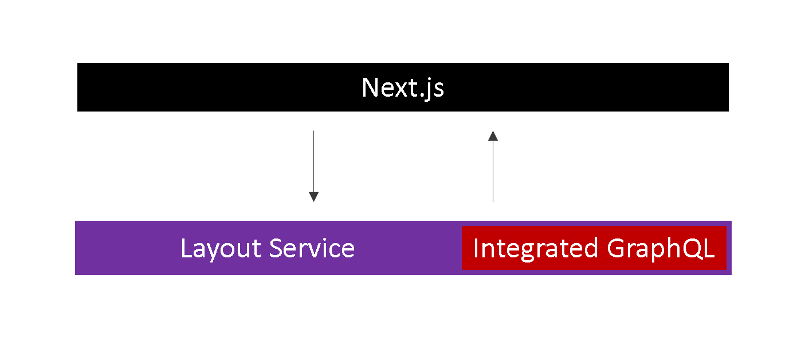
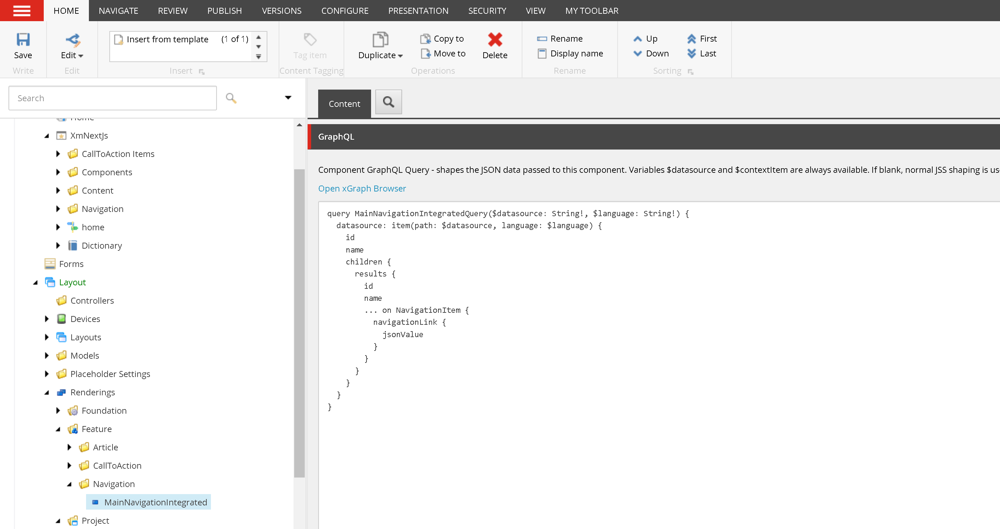
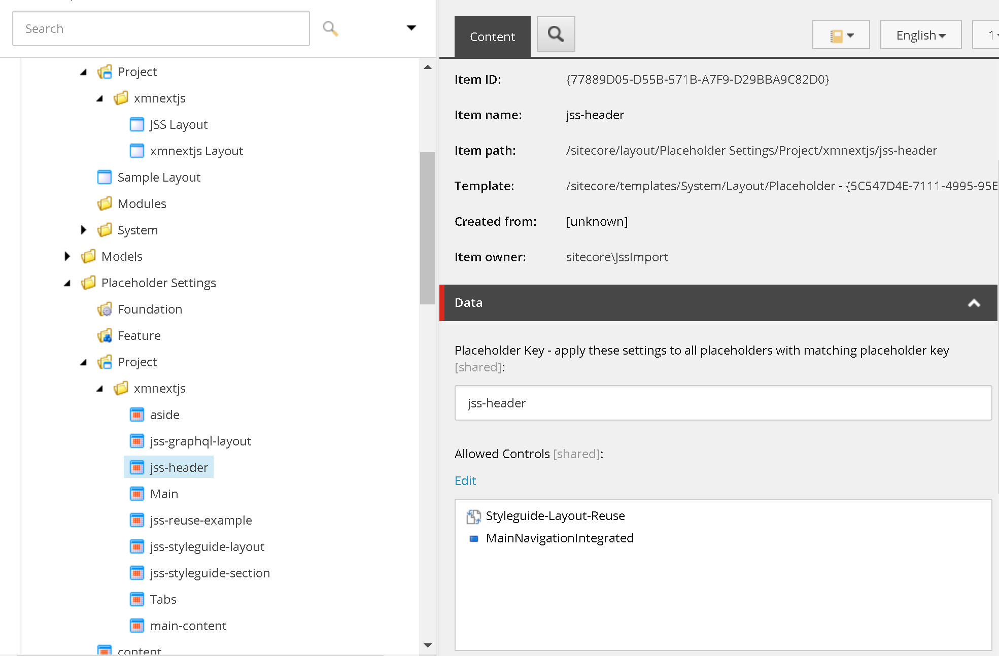
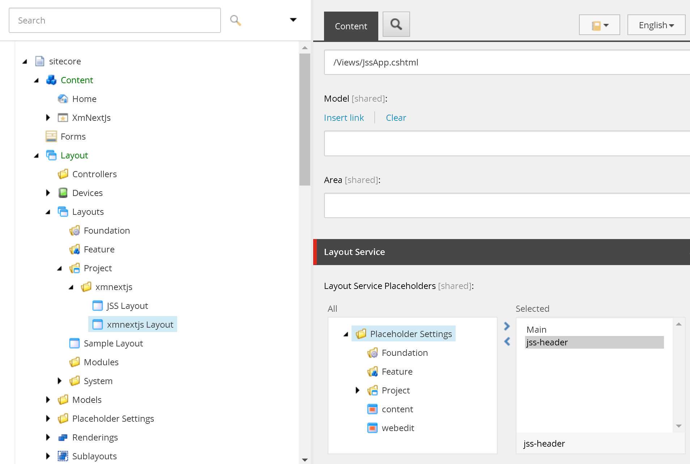

import { Callout } from 'nextra-theme-docs'

# Build a Sitecore Next.js component using GraphQL integrated mode

Integrated GraphQL in Sitecore executes GraphQL queries within the `Layout Service` endpoint, and merges the query results into the `Layout Service` result JSON.
This means that we only need to make one call to the `Layout Service` to grab both the datasource/page item data as well as what we queried with GraphQL.



In this guide, we will learn how to build a Sitecore Next.js component using GraphQL in integrated mode. So far our current main navigation is hardcoded -
we will rebuild it so that each link is content editable.  Also, since navigations are typically rendered in a different area of the page, we will utilize our
previous knowledge of [placeholders](/build/add-placeholders-in-sitecore-nextjs) and add a header placeholder.

If you haven't already, make sure you've [created the navigation items](/graphql/build-content-editable-navigation-items). Also, see how  we've [tested and build our GraphQL query](/graphql/xgraph-browser#build-graphql-query).

Our navigation items has the following structure:


And our GraphQL query:
``` graphql filename="QUERY"
query MainNavigationIntegratedQuery($datasource: String!, $language: String!) {
  datasource: item(path: $datasource, language: $language) {
    id
    name
    children {
      results {
        id
        name
        ... on NavigationItem {
          navigationLink {
            jsonValue
          }
        }
      }
    }
  }
}
```
## Create Navigation Json rendering
In the Content Editor,
1. Navigate to `/sitecore/layout/Renderings/Feature` and create a `Navigation` rendering folder
1. Under the `Navigation` folder, create a Json rendering `MainNavigationIntegrated`
1. On the `MainNavigationIntegrated` item, set fields
    1. `Datasource Location`: /sitecore/content/XmNextJs/Navigation
    1. `Datasource Template`: /sitecore/templates/Feature/Navigation/Navigation Folder
    1. `Component GraphQL Query`: *paste in the query above*



## Layout clean up
If we examine `src\rendering\src\Layout.tsx`, notice that the `Navigation` component is outside of the `jss-main` placeholder. We'll need
to clean this up and add a placeholder to hold our new `MainNavigationIntegrated` rendering.

``` tsx filename="src\rendering\src\Layout.tsx" {9}
return (
    <>
      <Scripts />
      <Head>
        <title>{fields.pageTitle.value.toString() || 'Page'}</title>
        <link rel="icon" href={`${publicUrl}/favicon.ico`} />
      </Head>

      <Navigation />
      {/* root placeholder for the app, which we add components to using route data */}
      <div className="container">{route && <Placeholder name="jss-main" rendering={route} />}</div>
    </>
  );
```

1. Remove the `Navigation` component
1. Add a `jss-header` placeholder
1. While we're here, let's make our HTML more semantic
    1. Wrap the `jss-header` placeholder with `<header>`
    1. Change `div.container` to `main.container`

``` tsx filename="src\rendering\src\Layout.tsx" {9-11,13}
return (
  <>
    <Scripts />
    <Head>
      <title>{fields.pageTitle.value.toString() || 'Page'}</title>
      <link rel="icon" href={`${publicUrl}/favicon.ico`} />
    </Head>

    <header>
      {route && <Placeholder name="jss-header" rendering={route} />}
    </header>
    {/* root placeholder for the app, which we add components to using route data */}
    <main className="container">{route && <Placeholder name="jss-main" rendering={route} />}</main>
  </>
);
```

## Placeholder updates
We previously learned the steps necessary to [add a placeholder](/build/add-placeholders-in-sitecore-nextjs) - we'll have to do the same steps here for our `jss-header` placeholder.  

In the Content Editor,
1. Update the `jss-header` placeholder setting to allow the `MainNavigationIntegrated` rendering
    1. Navigate to `/sitecore/layout/Placeholder Settings/Project/xmnextjs/jss-header`
    1. Under the `Allowed Controls`, add `MainNavigationIntegrated` 
    
    
1. Update the `xmnextjs Layout` to render `jss-header` data 
    1. Navigate to `/sitecore/layout/Layouts/Project/xmnextjs/xmnextjs Layout`
    1. Under `Layout Service Placeholders` field, add `jss-header`
    

## Add rendering
We would like to add the `MainNavigationIntegrated` rendering to every page. It is generally a good idea to create a base page template and have other page
templates inherit from this template. Fortunately for us, in our [create a page template](/build/create-a-sitecore-nextjs-page#create-a-page-template) tutorial,
we decided to use the `App Route` as our base template (Article Route inherits from this template). We'll continue to do the same.

1. Navigate to `/sitecore/templates/Project/xmnextjs/App Route/__Standard Values`. *Create the Standard Values, if it wasn't already created.*
1. Under `Presentation > Details > Shared Layout`, add the `MainNavigationIntegrated` rendering
    1. `Placeholder`: jss-header
    1. `Data Source`: /sitecore/content/XmNextJs/Navigation/Header

In Sitecore, publish our changes.

## Layout Service
As always, lets double check that our `Layout Service` returns the expected data.

In a browser, open `https://cm.xmnextjs.localhost/sitecore/api/layout/render/jss?item=/&sc_apikey={YOUR API KEY}&sc_mode=normal`


``` json showLineNumbers {13-14,17-18,22-23}
"sitecore": {
  "route": {
    ...
    "placeholders": {
      "jss-main": [...],
      "jss-header": [
          {
            "uid": "420108ad-deda-4944-a09d-63fdb9811582",
            "componentName": "MainNavigationIntegrated",
            "dataSource": "{2CD2AB0A-034B-474A-891B-87F8B883C0A8}",
            "params": {},
            "fields": {
              "data": {
                "datasource": {
                  "id": "2CD2AB0A034B474A891B87F8B883C0A8",
                  "name": "Header",
                  "children": {
                    "results": [
                      {
                        "id": "9F7596596F4C4EB48DF69F178260AB69",
                        "name": "Documentation",
                        "navigationLink": {
                          "jsonValue": {
                            "value": {
                              "href": "https://jss.sitecore.com",
                              "text": "Documentation",
                              "linktype": "external",
                              "url": "https://jss.sitecore.com",
                              "anchor": "",
                              "target": "_blank"
                            }
                          }
                        }
                      },
  ...
```
Take a note of the data structure returned by our GraphQL query in the `Layout Service`. We will need to map these on our component.

## Navigation Component
Finally, it is time to create our `MainNavigationIntegrated` component. We need to map our GraphQL data to types, loop through the data, and 
render our links. Note the usage of the `Link` component provided by `'@sitecore-jss/sitecore-jss-nextjs'`.

``` jsx filename="src\rendering\src\components\Feature\Navigation\MainNavigationIntegrated.tsx" showLineNumbers {1, 12-13, 20-21, 27-28, 33-34, 44-62}
import { Link, LinkField, withDatasourceCheck } from '@sitecore-jss/sitecore-jss-nextjs'
import { getPublicUrl } from '@sitecore-jss/sitecore-jss-nextjs';
import { ComponentProps } from 'lib/component-props';

// Prefix public assets with a public URL to enable compatibility with Sitecore Experience Editor.
// If you're not supporting the Experience Editor, you can remove this.
const publicUrl = getPublicUrl();

// These types maps to the Layout Service which has the GraphQL data
type MainNavigationProps = ComponentProps & {
  fields: {
    data: {
      datasource: DataSource
    }
  }
}
type DataSource = {
    id: string,
    name: string,
    children: {
      results: Array<NavigationItem>
    }
}
type NavigationItem = {
  id: string,
  name: string,
  navigationLink: {
    jsonValue:  LinkField
  } 
}

const MainNavigationIntegrated = (props: MainNavigationProps): JSX.Element => {
  // loop through the datasource children and grab all the jsonValues
  let navigationItems = props.fields.data.datasource.children.results.map(i => i.navigationLink.jsonValue);

  return (
    <div className="d-flex flex-column flex-md-row align-items-center p-3 px-md-4 mb-3 bg-white border-bottom">
      <h5 className="my-0 mr-md-auto font-weight-normal">
        <a className="text-dark" href="/">
          
        </a>
      </h5>
      <nav className="my-2 my-md-0 mr-md-3">
        {/* 
          The Link component expects an object on the field property with the structure
              "value": {
                "href": "...",
                "text": "...",
                "linktype": "...",
                "url": "...",
                "anchor": "...",
                "target": "..."
              }
        */}
        { navigationItems && navigationItems.map((item, index) => (
            <Link
              key={index}
              field={item}
              className='p-2 text-dark'
            />
          ))
        }
      </nav>
    </div>
  );
};

export default withDatasourceCheck()<MainNavigationProps>(MainNavigationIntegrated);
```
<Callout>
  Knowledge check:  
    1. What is the integrated GraphQL mode in Sitecore?
    1. Where do you enter the GraphQL query?
    1. *Excercise* - there are actually extra fields in our GraphQL query. Remove the unused fields from the query.
</Callout>