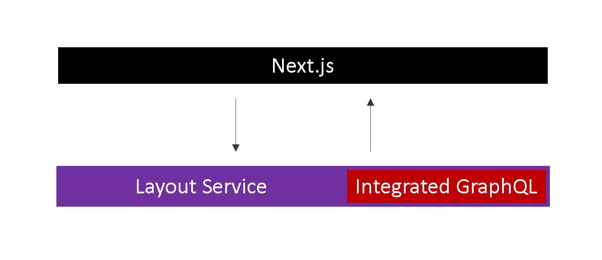
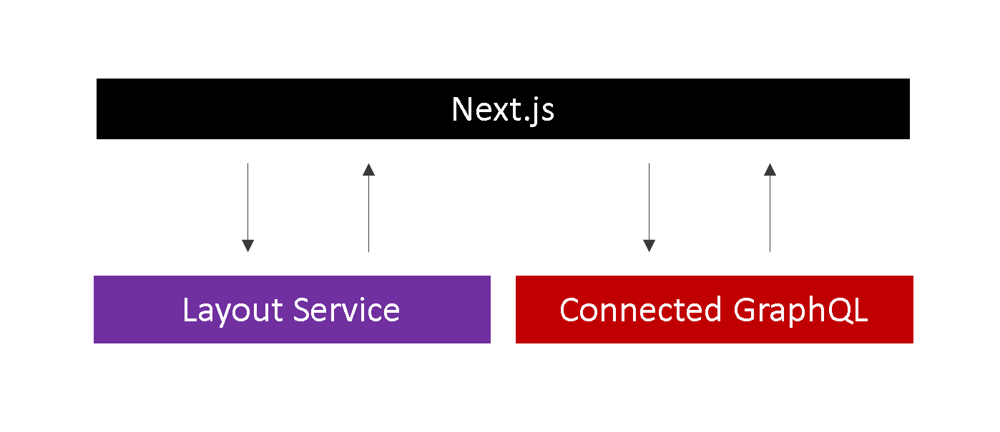

import { Callout } from 'nextra-theme-docs'

# GraphQL Overview
GraphQL is a query language that provides a flexible approach to API development.  It allows clients to request specific data they need from a server using a single query,
reducing over-fetching of data. You only query for fields you need.
``` graphql filename="QUERY"
{
    datasource {
        id
        name
    }
}
```
``` json filename="RESPONSE"
{
    datasource: {
        id: "2CD2AB0A034B474A891B87F8B883C0A8",
        name: "Header"
    }
}
```
This is in contrast to RESTful APIs, where each endpoint needs to be built ahead of time and each "schema" is predetermined.

So far, we have relied on the [Sitecore Layout Service](/build/sitecore-nextjs-component-content-editable#sitecore-layout-service) to retrieve data about the page and the datasource item.
What if we need to retrieve other items or even multiple items? This is where GraphQL comes in.

Sitecore comes with two (2) different modes of GraphQL:

1. **Integrated GraphQL** executes GraphQL queries within the `Layout Service` endpoint, and merges the query results into the Layout Service result JSON.
The net result is that we only need to make *one* call to the Layout Service to grab both the regular datasource/page item data as well as what we queried with GraphQL.


1. **Connected GraphQL** executes GraphQL queries directly against the `Sitecore GraphQL endpoint`. In contrast to the integrated GraphQL, this is an *additional* call -
one to the `Layout Service` (to get data about datasource/page item data) and one to the Sitecore GraphQL endpoint.


As you can imagine, Integrated GraphQL is often preferred.

**IMPORTANT** If you are using XM Cloud, it is [best practice](https://doc.sitecore.com/xp/en/developers/101/developer-tools/experience-edge-for-xm-best-practices.html#do-not-put-global-data-in-the-layout-service-output-for-pages) to NOT utilize Integrated QL for global data such as navigation. The reason for this is because XM Edge takes a snapshot of items at published time. If you make a change to the navigation and integrated mode is used, you'll have to publish every single page to update the data. Utilize **Connected GraphQL** instead.

For this section of the guide, we will explore how to build GraphQL queries and learn how to use GraphQL to grab multiple data items. If you have been following our guide,
the current main navigation is hardcoded. We will rebuild it so that each link is content editable.
We will learn both integrated and connected approaches, and learn the use case for each.

<Callout>
  Knowledge check:  
    1. What is GraphQL?
    1. How is it different from RESTful APIs?
    1. In Sitecore, what's the difference between integrated and connected mode?
</Callout>
