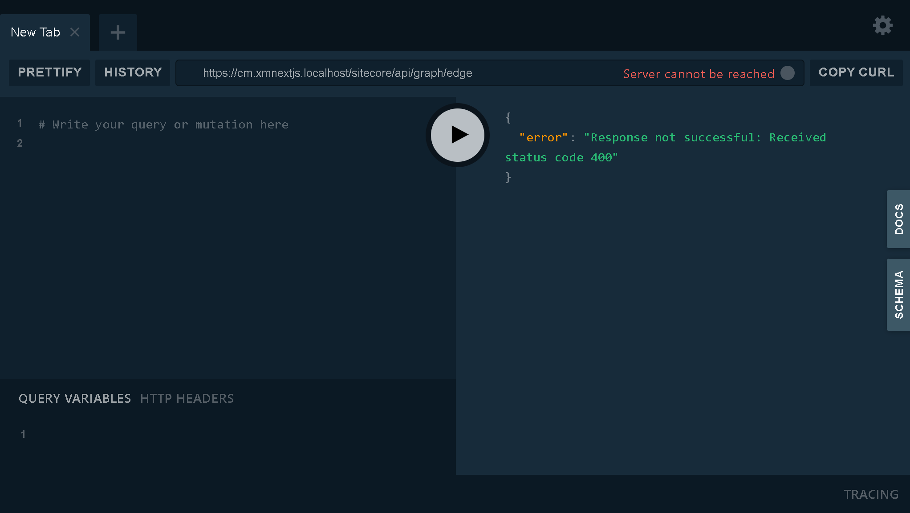

# xGraph Browser
Sitecore's xGraph Browser is a tool that allows developers to explore and query data using GraphQL. To get to it,
visit `{CM_DOMAIN}/sitecore/api/graph/edge/ui` e.g. `https://cm.xmnextjs.localhost/sitecore/api/graph/edge/ui`



There are three (3) areas in the xGraph browser:
1. Area to build your GraphQL query
1. Area to pass in query variables and HTTP headers
1. Result of the query

## Build GraphQL Query
Our navigation items has the following structure.


In the xGraph Browser, let us build the GraphQL query to retrieve data about all the items under the `Header` item.
``` graphql filename="QUERY"
query MainNavigationIntegratedQuery($datasource: String!, $language: String!) {
  datasource: item(path: $datasource, language: $language) {
    id
    name
    children {
      results {
        id
        name
        ... on NavigationItem {
          navigationLink {
            jsonValue
          }
        }
      }
    }
  }
}
```

### API key
To execute the query, we must pass in an API key to query. You can find your API key under `/sitecore/system/Settings/Services/API Keys`. It is the item ID of the item under that path.
You can also find this API key under `src\rendering\scjssconfig.json`.

``` json filename="HTTP HEADERS"
{
  "sc_apikey": "6924E4B6-DA0E-44FB-AE25-8C7A8FA2DFBF"
}
```

### Query variables
We must also pass in the values of the parameters of the query. Since we want to retrieve information about the navigation items under !!!@#. We must also specify a language.
``` json filename="QUERY VARIBLES"
{
  "datasource":"/sitecore/content/XmNextJs/Navigation/Header",
  "language": "en"
}
```

## Result
You should have something like the following as a result. **Note** your IDs maybe different - this is normal.
``` json filename="RESULT"
{
  "data": {
    "datasource": {
      "id": "2CD2AB0A034B474A891B87F8B883C0A8",
      "name": "Header",
      "children": {
        "results": [
          {
            "id": "9F7596596F4C4EB48DF69F178260AB69",
            "name": "Documentation",
            "navigationLink": {
              "jsonValue": {
                "value": {
                  "href": "https://jss.sitecore.com",
                  "text": "Documentation",
                  "linktype": "external",
                  "url": "https://jss.sitecore.com",
                  "anchor": "",
                  "target": "_blank"
                }
              }
            }
          },
          ...
        ]
      }
    }
  }
}
```