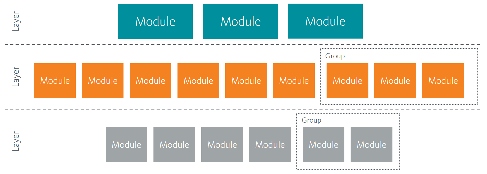

import { Callout, FileTree } from 'nextra-theme-docs'

# Sitecore Helix Overview
Sitecore Helix is a collection of design principles and best practices for the solution architecture of Sitecore implementations.  At a high level,
it is a modular architecture.

The core concepts are:
1. **Modules** &ndash; group code by business functionality not technical functionality.
1. **Layers** &ndash; separate your modules into `Foundation`, `Feature`, and `Project` layers.
1. **Dependencies** &ndash; `Foundation` layer is at the bottom of the dependency chain, followed by `Feature`, and finally `Project` layer.

*Image credit: [Sitecore](https://helix.sitecore.com/principles/architecture-principles/index.html)*

You can learn more about [Sitecore Helix here](https://helix.sitecore.com/introduction/index.html).  

## Sitecore Helix in a Next.js (and other JavaScript) site
Most developers working with Sitecore are familiar with the Helix principles. However, moving to a Next.js site some have wondered:
do we still follow the Helix guidelines? How?

Some have recommended to put everything on the project layer. I believe there is still some value to the Helix principles.
In this section of the guide, we will explore an approach to Sitecore Helix in a Next.js (and other JavaScript) site.

### Modules
When we create components, we should colocate code related to each other. As your code base grows, it is alot easier to maintain and it is alot
quicker to find code related to your component.

<Callout type="info">
    Correct
</Callout>
<FileTree>
  <FileTree.Folder name="components" defaultOpen>
    <FileTree.Folder name="Account" defaultOpen>
      <FileTree.File name="Account.module.css" />
      <FileTree.File name="Account.tsx" />
      <FileTree.File name="Account.graphql" />
    </FileTree.Folder>
    <FileTree.Folder name="Login" defaultOpen>
      <FileTree.File name="Login.module.css" />
      <FileTree.File name="Login.tsx" />
    </FileTree.Folder>
  </FileTree.Folder>
</FileTree>

<Callout type="error">
    Incorrect
</Callout>
<FileTree>
  <FileTree.Folder name="components" defaultOpen>
    <FileTree.File name="Account.tsx" />
    <FileTree.File name="Carousel.tsx" />
  </FileTree.Folder>
  <FileTree.Folder name="styles" defaultOpen>
    <FileTree.File name="Account.module.css" />
    <FileTree.File name="Carousel.module.css" />
  </FileTree.Folder>
  <FileTree.Folder name="graphql" defaultOpen>
    <FileTree.File name="Account.graphql" />
  </FileTree.Folder>
</FileTree>

### Layers
Code should further be separated into layers.

1. **Feature** &ndash; This layer contains components closely related to the business domain. 
1. **Foundation** &ndash; Code that is used by multiple features are on this layer.  
1. **Project** &ndash; Known as the composition layer, it is on this layer that all features are stitched together.
<FileTree>
  <FileTree.Folder name="components" defaultOpen>
    <FileTree.Folder name="Feature" defaultOpen>
      <FileTree.Folder name="Account" defaultOpen>
        <FileTree.Folder name="Account" defaultOpen>
          <FileTree.File name="Account.module.css" />
          <FileTree.File name="Account.tsx" />
          <FileTree.File name="Account.graphql" />
        </FileTree.Folder>
        <FileTree.Folder name="Login" defaultOpen>
          <FileTree.File name="Login.module.css" />
          <FileTree.File name="Login.tsx" />
        </FileTree.Folder>
      </FileTree.Folder>
      <FileTree.Folder name="Navigation" defaultOpen>
        <FileTree.Folder name="MainNavigation" defaultOpen>
          <FileTree.File name="MainNavigation.module.css" />
          <FileTree.File name="MainNavigation.tsx" />
          <FileTree.File name="MainNavigation.graphql" />
        </FileTree.Folder>
      </FileTree.Folder>
    </FileTree.Folder>
    <FileTree.Folder name="Foundation" defaultOpen>
      <FileTree.Folder name="Authentication" defaultOpen>
        <FileTree.File name="Authentication.ts" />
      </FileTree.Folder>
    </FileTree.Folder>
    <FileTree.Folder name="Project" defaultOpen>
      <FileTree.Folder name="Structure" defaultOpen>
        <FileTree.File name="OneColumnLayout.tsx" />
        <FileTree.File name="TwoColumnLayout.tsx" />
      </FileTree.Folder>
    </FileTree.Folder>
  </FileTree.Folder>
</FileTree>

### Dependencies
In Sitecore Helix, dependencies should flow downwards. This means that features should not rely on other features. Taking the example from above, the `Navigation` feature should not have
a reference to the `Account` feature and vice versa.

If multiple features or components rely on a piece of code, it most likely should be abstracted out and place on the `Foundation` layer. Taking the example from above again, both the `Login` and the `Account` component relies
on `Authentication` so that code is placed o the `Foundation` layer.

This also means that `Foundation` layer code should be the most stable and the least likely to change. When changing code on the `Foundation` layer, one must be careful
as the code can affect multiple features.

*Image credit: [Sitecore](https://helix.sitecore.com/principles/architecture-principles/layers.html)*